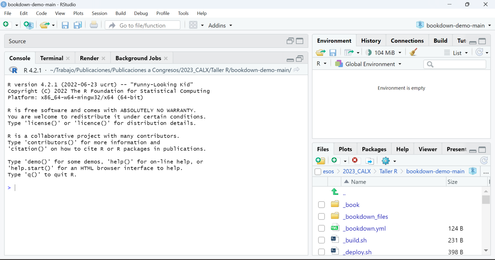
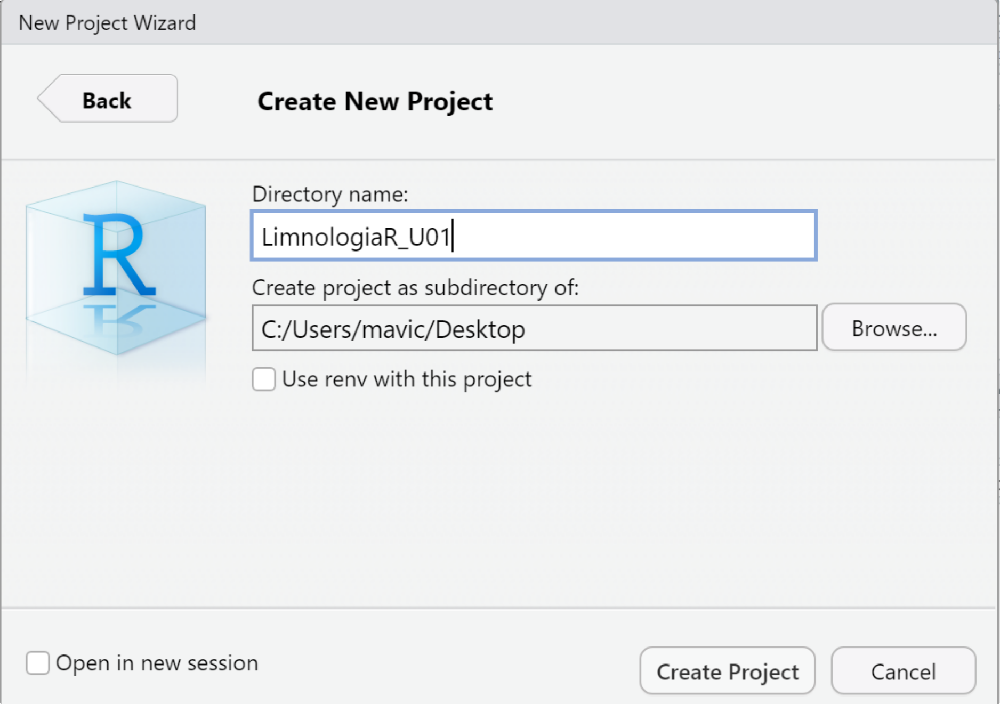

# Introducción a R y RStudio {#intro}

**Sofía Carusso**[^01-introso-1]

[^01-introso-1]: [soficarusso\@gmail.com](mailto:soficarusso@gmail.com){.email}

Museo Argentino de Ciencias Naturales Bernardino Rivadavia-CONICET

& **María Victoria Quiroga**[^01-introso-2]

[^01-introso-2]: [mvquiroga\@iib.unsam.edu.ar](mailto:mvquiroga@iib.unsam.edu.ar){.email}

Instituto Tecnológico de Chascomús (INTECH, UNSAM-CONICET), Escuela de Bio y Nanotecnologías (UNSAM)

## Instalación

Seguir las indicaciones de la página <https://posit.co/download/rstudio-desktop/> para descargar e instalar **R** y **RStudio**. Es muy importante que lo haga de manera secuencial como se indica, primero **R** y luego **RStudio**.

```{r posit, echo = FALSE, out.width='100%', fig.align='center', fig.cap='Instalación de R y RStudio.'}
knitr::include_graphics('./images/posit.png')
```

## RStudio

La primera vez que abrimos RStudio la interfaz nos muestra tres paneles:

-   *Panel izquierdo* -**Consola**: donde corremos el código
-   *Panel derecho superior* -solapa **Entorno**: vemos los datos y funciones que cargamos en la sesión de R.
-   *Panel derecho inferior* -solapa **Files**: directorio de trabajo y archivos dentro de la carpeta.
-   *Panel derecho inferior* -solapa: **Gráficos**: visualización de plots.
-   *Panel derecho inferior* -solapa: **Paquetes**: visualización/carga/actualización de paquetes de R.
-   *Panel derecho inferior* -solapa: **Ayuda**: Recuerde que puede buscar ayuda desde esta solapa o tipeado en la consola `?nombre_del_comando`.

```{r rstudio, echo = FALSE, out.width='100%', fig.align='center', fig.cap='Interfaz de RStudio.'}

```

## ¡A trabajar!

### Crear un **Proyecto**

1.  Click en `File` ( *esquina superior izquierda en* Figura \@ref(fig:rstudio)).
2.  Click en `New Project`.
3.  Click en `New Directory`.
4.  Click en `New Project`.
5.  Escribir el nombre de la carpeta, que será el **Directorio de Trabajo** y contendrá el **Proyecto**. Se puede setear la ubicación de la carpeta haciendo click en `Browse`. En la Figura \@ref(fig:project) se creó la carpeta LimonologiaR_U01 en el Escritorio.
6.  Click en `Create Project`.

```{r project, echo = FALSE, out.width='75%', fig.align='center', fig.cap='Crear un nuevo proyecto para la Unidad 1.'}

```

Ver el **Directorio de Trabajo**:

```{r eval=FALSE}
getwd()
```

*Recomendaciones:*

Crear una carpeta para cada unidad, para tener los análisis separados y ordenados.

Generar nombres de carpetas y archivos **sin** espacios, acentos o caracteres especiales.

### Crear un **R Script**

1.  Click en `New file`.
2.  Click en `R Script`.

-   Se puede utilizar el atajo `Ctrl+Shift+N`.

Recuerde las recomendaciones para nombrar archivos al `guardar` el script.

El script se va a guardar como archivo *.R* en el **Directorio de Trabajo**.

```{r script, echo = FALSE, out.width='75%', fig.align='center', fig.cap='Crear un nuevo R Script.'}
knitr::include_graphics('./images/script.png')
```

En este **script** se escribe y guarda el código.

Una forma fácil de copiar código es utilizando el botón `Copy to clipboard` que se encuentra en la esquina superior izquierda de los `bloques de código` (Figura \@ref(fig:copycode)).

```{r copycode, echo = FALSE, out.width="30%", fig.align="center", fig.cap="Copiar código desde el material del taller."}
knitr::include_graphics("./images/copycode.png")
```

Se pega o escribe `código` en el **script** y se `guarda` haciendo click como se indica en el *recuadro 1* de la Figura \@ref(fig:code).

El código en el **script** se `ejecuta` haciendo click en `Run the current line or selection` ( *recuadro 2* en Figura \@ref(fig:code)). Podemos ejecutar de una línea por vez: nos situamos en una línea y hacemos click; o podemos ejecutar varias líneas juntas: seleccionamos el set de líneas y hacemos click. La última opción *no* se recomineda si es la primera vez que corre el código.

El código se ejecuta en la **consola** Figura \@ref(fig:code).**2**.

Se observan los resultados en la **consola** Figura \@ref(fig:code).**3**.

Los resultados se pueden copiar de la **consola** y pegar en el **script**. Recuerde marcar los resultados como comentarios (líneas que comienzan con `#`). *Atajo: seleccionar todas las lineas de resultados y presionar* `Ctrl+Shift+C`.

R **no** ejecuta lo que se encuentra después de `#`.

```{r code, echo = FALSE, out.width="100%", fig.align="center", fig.cap="Trabajo en la interfaz de RStudio. 1- Guardar Script. 2- Ejecutar código desde Script. 3- Resultados en consola"}
knitr::include_graphics("./images/code.png")
```

### Instalar y cargar **paquetes**

Los paquetes se instalan (por única vez) desde la **consola** con `install.packages("nombre")` o desde la interfase de la solapa **Packages**.

Los paquetes se cargan en la sesión con `library("nombre")`.

-   **Buenas prácticas!** Conviene poner todas las librerías que se vayan a usar al comienzo.

### Importar **datos**

Hay diversas maneras de leer datos. Podemos leer datos

-   *.txt*

    -   Conviene guardar la base de datos como txt (Tab delimited); donde las columnas quedan definidas por espacios.

-   *.csv* Comma/Separated Values

    -   Archivos de texto separados por comas. Se forma una tabla de filas y columnas

-   *.xls*

Generalmente se utiliza un comando `read`, por ejemplo `read.csv("Nombre del archivo.csv")`, según el tipo de archivo que se trate (txt, xlsx, etc.)

Una vez que tenemos cargado nuestro conjunto de datos nos puede interesar realizar algunos comandos exploratorios que nos van a dar información acerca de este *data frame* (estructura de datos).

-   `summary(objeto)`
    -   La salida va a depender de la clase de objeto al cual lo aplicamos.
    -   Útil para ver información básica sobre nuestras variables
    -   Para *data frames* el summary nos devuelve el valor mínimo, máximo, la mediana y el 1er y 3er cuantil.
    -   Si se aplica para salidas de modelos lineales (Ver Unidad 2), nos proporciona información acerca de los residuos, los coeficientes del modelo, el error estándar residual, R^2^, el R ajustado, el estadístico F y el p valor.
-   `str(objeto)`
    -   Nos devuelve cuántas observaciones tiene el data frame, información acerca de las variables (son numéricas? factores?); como esta estructurado nuestro conjunto de datos.
-   `head(objeto)` y `tail(objeto)`
    -   Nos da las primeras y últimas filas, respectivamente.
-   `class(objeto)`
    -   Devuelve qué tipo de objeto es (data frame, matrix, vector, etc).

```{r}

data("iris")

summary(iris)

str(iris)

head(iris)

class(iris)

```

### Visualizar y manipular **datos**

Qué tipo de variables hay?

Existen variables numéricas (num), factores (que pueden tener varios niveles, factor), char o de caracter. Generalmente R detecta el tipo de variable al cargar los datos. Se puede transformar variables entre sí.

-   **Observación** El comando `c()` nos permite concatenar elementos. Siempre que se selecciona más de un elemento se debe concatenar.

Por ejemplo,

```{r}

variable <- c(1,2,1,1,1,2,2,2,1)

class(variable)

factor <- factor(variable, levels = c(1,2), labels=c("Nivel 1", "Nivel 2"))

```

De esta manera, transformamos una variable numerica en un factor con dos niveles, Nivel 1 y 2. Nos puede ser útil en caso de tener una variable tomada desde campo (o de encuestas) como numérica y querramos que sea categórica.

Podemos acceder a elementos particulares dentro del data frame, ya sea porque nos interesa ver ese elemento individual, para sacarlo del data frame, **para armar filtros** o para realizar ciertos análisis con una parte del data frame. Se trabaja con coordenadas (x,y), donde **x** es la fila e **y** la columna.

Si quiero todos los datos de una fila en particular, por ejemplo la 17 se escribe `iris[17,]` (seleccionamos la fila y las columnas quedan vacías porque queremos verlas todas).

De la misma manera, si queremos ver solamente una columna `iris[,3]`. También podemos llamarlo según el nombre de la misma `iris[,"Species"]`.

Para seleccionar los primeros 10 datos `iris[1:10,]` (o con el comando que ya vimos **Head()**).

Si queremos seleccionar **varias filas** simplemente las concatenamos. Entonces si escribimos`iris[c(1:5), c(2,3)]` Qué seleccionamos en este caso?

Qué pasa si quiero seleccionar una sola variable? Podemos! El signo **\$** indica que se selecciona una columna dentro del dataframe que lo precede.

`iris$Sepcies` me permite ver toda la columna de la variable Especies. De esta manera, incluso podemos crear variables nuevas, asignandolas de la siguiente manera

```{r}
iris$variable.nueva <- iris$Sepal.Length/iris$Sepal.Width
```

Qué variable nueva acabamos de crear?

-   **Ojo!** Si no le asignamos el dataframe a la variable nueva con el signo `$` (`iris$variablenueva`) el R la va a crear por fuera de nuesto data frame como un vector de los valores.

[Subsets]{.underline}

Como lo indica el nombre, nos quedamos con una porción que seleccionemos del data frame, y sobre el cual podremos operar de manera independiente, sin que el data frame original se vea afectado.

En el ejemplo con iris, podemos crear un subset que contenga solamente a la especie iris setosa.

```{r}
setosa <- subset(iris, iris$Species=="setosa")
```

Para aquellos que se sientan más cómodos, la libreria **dplyr** permite hacer que las selecciones y filtros sea más fácil. Suma mucho a la facilidad del trabajo aprender a usarla!

```{r warning = FALSE, message = FALSE}
library(dplyr)

setosa.dplyr <- iris %>% 
  filter (Species %in% "setosa") 

```

Hay muchas formas de hacer subsets! Es cuestion de usar aquella con la que se sientan más cómodos.

### Gráficos exploratorios básicos

La visualización de datos es un punto clave dentro de cualquier análisis. Los gráficos son útiles para explorar datos, interpretarlos, identificar patrones, detectar outliers y constituyen una de las mejores maneras de comunicar los resultados.

[¿Qué tipos de gráficos existen?]{.underline}

Hay una enorme diversidad, e incluso se pueden utilizar combinaciones de ellos para aumentar la información comunicada.

-   **Gráfico de barras**
    -   Muestra una barra para cada categoría de una variable categórica. El alto muestra el valor observado para cada categoría (Fig 1.A)
-   **Gráfico de puntos/dispersión/*scatter plot***
    -   Muestra la relación entre dos variables numéricas.
-   **Histograma**
    -   Aplica para *variables cuantitativas*. Permite ver la distribucion de la variable.
-   **Boxplot**
    -   Aplica para *variables cuantitativas*. Muestra una serie de medidas de resumnen para dicha variable. Se suele graficar junto a una variable categórica para permitir la comparación entre niveles.

```{r}
library(ggplot2)
library(ggpubr)
library(grid)


barra <- iris %>% 
  group_by(Species) %>% 
  summarise(n=n()) %>% 
  ggplot(aes(Species,n, fill=Species))+
  geom_bar(stat="identity")

scatter <- iris %>% 
  ggplot(aes(Sepal.Length, Petal.Length, color=Species)) +
  geom_point()

histo <- iris %>% 
  ggplot(aes(Sepal.Length, fill=Species)) +
  geom_histogram()

box <- iris %>% 
  ggplot(aes(Species, Petal.Length, fill=Species)) +
  geom_boxplot()


```

```{r fig.align='center', fig.cap='Tipos de gráficos. A) Gráfico de barras. B) Scatter plot, gráfico de puntos. C) Histograma. D) Boxplot', out.width='100%'}

ggarrange(barra,scatter,histo,box, ncol=2, nrow = 2, widths = c(0.5,0.5), labels=c("A", "B", "C", "D"))

```

[¿R base o Ggplot2?]{.underline}

La librería en la que se suelen armar los gráficos y que nunca falta en ningún script es **ggplot2**. Sin embargo, R permite realizar gráficos nativamente sin librerías.

*R base*

Las ventajas de usar R base para graficar es que es su rapidez para visualizar las relaciones entre variables, sin tener que preocuparnos por acordarnos de la sintaxis del script. Sin embargo, ggplot2 ofrece una variedad de combinaciones de customizacion para presentar los datos difícil de equiparar.

El comando básico es `plot()`entre dos variables. Es decir,

```{r}
plot(iris$Petal.Length,iris$Petal.Length)
```

De ahi en adelante, se pueden agregar distintos parámetros que hagan a la customizacion. Por ejemplo,

```{r,fig.align='center', fig.cap='Tipos de gráficos', out.width='100%'}

plot(iris$Petal.Length,iris$Petal.Width,
     cex=2, # Tamaño de la forma
     pch=16, # Forma (puede ser circulo, triangulo, etc)
     xlab="Petal Length", # Titulo del eje x
     ylab="Petal Width", # Titulo del eje y
     main="Petal Width vs Petal Length of Iris", # Titulo del grafico
     col=iris$Species) # Si quiero agregarle color a los puntos. En ese caso, lo hace segun los niveles de la variable Species. 

legend(x=1, y=2.4, legend=levels(iris$Species), col=c(1:3), pch=16) # Leyenda 


```

Veamos como se hace el resto de los gráficos:

```{r, fig.align='center', fig.cap='Tipos de gráficos', out.width='100%'}
# Barra
plot(iris$Species)

# Boxplot
plot(iris$Species, iris$Sepal.Length,
     xlab="Species",
     ylab="Sepal Lenght",
     main="Sepal Lenght by Iris species",
     col="skyblue")

# Historgram
hist(iris$Sepal.Width,
     col="yellow",
     xlab="Sepal Width",
     main="Histogram of Sepal Width",
     breaks=30)


# Qué pasa si queremos plotear el data frame entero? 

plot(iris)

```

*ggplot2*

Este paquete tiene una manera de escribirse particular en capas. Los gráficos de ggplot2 está compuesto por los datos, por un conjunto de características estéticas a tener en cuenta entre los datos junto con los aspectos visuales (*aes, aesthetic mapping*) y por al menos una capa que indica cómo se debe manipular cada observación (*geom\_*).

```{r}
library(ggplot2)

ggplot(iris, aes(x=Petal.Length, y=Petal.Width))+
  geom_point()

```

-   **Buenas prácticas!** Conviene usar un renglón por capa, de esta manera es fácil detectar errores y ver cómo se va modificando el gráfico a medida que van agregando capas.

Al igual que en el plot del R base, se pueden cambiar los colores y formas. Sin embargo, esto va a estar atado a qué elemento queremos cambiar.

```{r}

ggplot(iris, aes(x=Petal.Length, y=Petal.Width))+
  geom_point(aes(colour=Species)) 

```

En este caso, quise cambiar el color de los puntos. Para ello, lo tengo que especificar en la capa *aes* del geom_point.

```{r}
ggplot(iris, aes(x=Petal.Length, y=Petal.Width, color=Species))+
  geom_point() 
```

También puede ir en el aes general del gráfico. No solo puedo cambiar el color, sino también formas. O combinar todo:

```{r}

ggplot(iris, aes(x=Petal.Length, y=Petal.Width, shape=Species))+
  geom_point() 


ggplot(iris, aes(x=Petal.Length, y=Petal.Width, size=Sepal.Length))+
  geom_point(aes(color=Species)) 
```

Noten que se generan automáticamente las leyendas, según vamos cambiando lo estético, a diferencia de R base.

Este es un primer pantallazo el mundo de ggplot. Hay mucho para aprender y en general, todo lo que quieran graficar van a poder, y de muchisimas maneras.

Google es su gran amigo!

### Recursos extra recomendados

Uso de la libreria **ggpubr** para alinear plots <http://www.sthda.com/english/articles/24-ggpubr-publication-ready-plots/81-ggplot2-easy-way-to-mix-multiple-graphs-on-the-same-page/>

Healy K. 2019. Data visualization: A practical Introduction **Versión libre online:**\
<https://socviz.co/index.html#preface>

R Charts <https://r-charts.com/es/ggplot2/>

Cheatsheet en Code <http://zevross.com/blog/2014/08/04/beautiful-plotting-in-r-a-ggplot2-cheatsheet-3>
