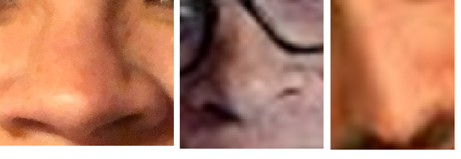
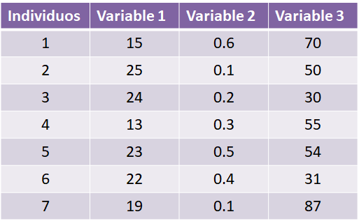
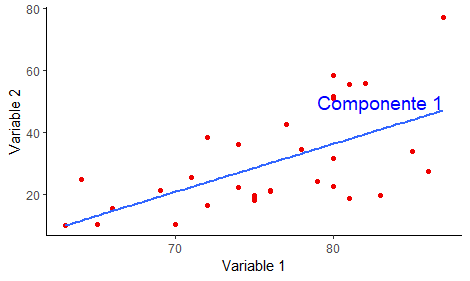
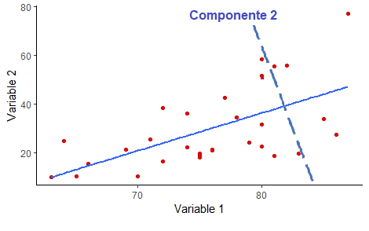

# Análisis multivariados I {#multi1}

**Patricia E. García**^[garciapatriciaelizabeth@gmail.com]

Instituto de Investigaciones en Biodiversidad y Medioambiente (INIBIOMA, CONICET-UNComahue)


En esta unidad se verán ejemplos de ACP, NMDS, PERMANOVA

## Análisis de Componentes Principales

*Introducción*: Algunos sistemas no pueden definirse por sus características individuales, sino que deben verse en conjunto. Un ejemplo muy sencillo para entender este concepto es intentar describir una cara humana con un solo rasgo: la nariz.



Para describir y reconocer una cara es necesario observar todas sus características: la nariz, los ojos, la boca, las cejas, etc. Es decir, múltiples dimensiones.

El **análisis de componentes principales (APC)** también conocido por siglas en inglés Principal Componentes Analysis PCA, es una poderosa herramienta estadística para describir un conjunto de datos.

Se basa en la reducción de la multidimensionalidad de una manera "*no supervisada*".

Su principal objetivo es proyectar datos en las direcciones de **máxima varianza** y de este modo eliminar aquellas direcciones o planos que aporten menos información.

El ACP puede aplicarse antes de realizar un análisis de regresión o simplemente con fines exploratorios para ayudar a los investigadores a comprender relaciones entre las variables o descubrir patrones presentes en los datos.

### ¿Qué tipos de datos usa una ACP?

Utiliza principalmente variable *numéricas continuas* que son las que efectivamente entran en el análisis. Estás variables se organizan en **columnas**, mientras que en las **filas** se organizan los individuos.



Estas bases de datos son de doble entrada, por lo que es posible analizarla desde el punto de vista de los individuos, de tal manera que *individuos* que tiene características similares estarán más cerca.

Desde el punto de las *variables*, se pueden analizar las relaciones entre las mismas. El análisis considera relaciones lineales entre las variables y usa coeficientes de correlación. Es importante utilizar la matriz de correlación para observar las relaciones más importantes entre las variables.

### ¿Cómo funciona el análisis?

El funcionamiento del análisis es muy sencillo, trata de buscar la *dirección o componente* que maximice la variación de datos. Es decir que el primer plano/componente trata de capturar la mayor dispersión de los datos.



En el ACP, luego que se encontró el primer componente que maximizó la dispersión de los datos, el segundo componente es ortogonal, es decir a 90°.



### Ahora manos a la obra: miremos datos

En RStudio importamos la base de datos ambientales de [Castro Berman et al., 2018](https://doi.org/10.1016/j.chemosphere.2018.02.103), disponible como **data_cursoR.xlsx** en [GitHub Limno-con-R/CILCAL2023](https://github.com/Limno-con-R/CILCAL2023/tree/main/datasets). Recuerden guardar el archivo en una carpeta llamada _data_, dentro del **Directorio de Trabajo** del **Proyecto** que creamos para esta Unidad (ver cómo hacerlo en la Unidad \@ref(intro)). 

```{r}
library(readxl)
datos <-  read_excel("data/data_cursoR.xlsx", 
    col_types = c("text", "numeric", "numeric", 
        "numeric", "numeric", "numeric", 
        "numeric", "numeric", "numeric", 
        "numeric", "numeric", "numeric", 
        "numeric", "numeric", "numeric", 
        "numeric", "numeric", "numeric"), 
    na = "NA")
```

```{r}
datos <- data.frame(datos, row.names = 1)
head(datos)
```

La base de datos que importamos contiene información acerca de la localización geográfica de los sitios y las variables físico-químicas.

```{r}
summary(datos)
```

    ##    ELEVACION         LATITUD          LONGITUD           Temp      
    ##  Min.   :-16.00   Min.   :-38.93   Min.   :-63.09   Min.   : 7.00  
    ##  1st Qu.: 10.00   1st Qu.:-37.49   1st Qu.:-62.25   1st Qu.:15.00  
    ##  Median : 58.50   Median :-36.84   Median :-60.23   Median :17.50  
    ##  Mean   : 73.65   Mean   :-36.62   Mean   :-60.13   Mean   :18.52  
    ##  3rd Qu.:104.00   3rd Qu.:-35.69   3rd Qu.:-57.98   3rd Qu.:22.25  
    ##  Max.   :246.00   Max.   :-34.48   Max.   :-56.98   Max.   :30.00  
    ##                                                                    
    ##      Secchi             DO               pH         Conductivity    
    ##  Min.   :  7.00   Min.   : 5.000   Min.   :8.000   Min.   :  0.320  
    ##  1st Qu.: 12.00   1st Qu.: 8.725   1st Qu.:8.557   1st Qu.:  1.215  
    ##  Median : 18.00   Median :10.300   Median :8.795   Median :  2.615  
    ##  Mean   : 29.44   Mean   :10.238   Mean   :8.762   Mean   :  7.968  
    ##  3rd Qu.: 37.75   3rd Qu.:11.050   3rd Qu.:8.982   3rd Qu.:  5.513  
    ##  Max.   :140.00   Max.   :20.000   Max.   :9.400   Max.   :202.100  
    ##                                                                     
    ##       NTU              TON             TDON           SPM        
    ##  Min.   :  2.70   Min.   : 2856   Min.   :1926   Min.   :  6.70  
    ##  1st Qu.: 27.90   1st Qu.: 4104   1st Qu.:3052   1st Qu.: 36.20  
    ##  Median : 83.25   Median : 4872   Median :3478   Median : 75.45  
    ##  Mean   : 88.67   Mean   : 5063   Mean   :3790   Mean   :116.83  
    ##  3rd Qu.:110.00   3rd Qu.: 5323   3rd Qu.:4356   3rd Qu.:128.53  
    ##  Max.   :363.00   Max.   :10830   Max.   :7235   Max.   :788.40  
    ##                                                                  
    ##       POM               TP              TDP             Chl.a       
    ##  Min.   :  6.70   Min.   :  46.0   Min.   :   0.1   Min.   :  1.58  
    ##  1st Qu.: 20.00   1st Qu.: 324.0   1st Qu.: 114.0   1st Qu.: 15.80  
    ##  Median : 29.60   Median : 533.0   Median : 302.0   Median : 52.05  
    ##  Mean   : 40.80   Mean   : 766.1   Mean   : 560.3   Mean   : 87.80  
    ##  3rd Qu.: 47.92   3rd Qu.: 820.5   3rd Qu.: 624.0   3rd Qu.: 89.13  
    ##  Max.   :344.00   Max.   :4538.0   Max.   :4140.0   Max.   :981.06  
    ##                                                                     
    ##       DOC         
    ##  Min.   :   1.26  
    ##  1st Qu.:  12.36  
    ##  Median :  19.45  
    ##  Mean   :  93.22  
    ##  3rd Qu.:  97.58  
    ##  Max.   :1010.00  
    ##  NA's   :1

En resumen, tenemos 52 observaciones (individuos) y 17 variables. De las variables presentes las primeras 3 (Elevación, Longitud y Latitud) corresponden a la localización de los ambientes.

Las variables son continuas y cada una está medida de manera distintas por lo que cada una tiene su unidad y a su vez su variación. Debido a esto es necesario **estandarizar** y **centrar** las variables. La estandarización simplemente le resta a cada observación el promedio de la variable y la divide por la desviación estandar de la variable. Mientras que centrar significa que se mueve la nube de puntos de los individuos al centro de gravedad.

```{r}
?scale # el comando para estandarizar los datos
datos.stand <- data.frame(scale(datos [4:17], center = T))
```

Para este ejemplo solo usé las variables físico-químicas, para ello utilicé los corchetes e indiqué el número de columnas que quería se estandarizaran, de la columna 4 a la columna 17: **[4:17]**.

El comando para realizar el análisis de componentes principales , está en el paquete FactoMiner. Este paquete es muy versatil y se mantiene actualizado. Aqui adjunto el link:

[FactoMineR](http://factominer.free.fr)

```{r echo=TRUE}
library(FactoMineR)
?PCA ## ayuda del comando PCA
# Realizar el analisis solo en las variables numericas continuas
res.pca <- PCA(datos.stand [-2], graph=FALSE) # se guarda en el objeto res.pca (uso res para indicar que es un resultado) ## Saqué la variable sechi del analisis [-2]
```

¡Recibimos un ***mensaje de advertencia***! Este mensaje nos indica que hay valores faltantes y que el comando va a usar el promedio de la variable en las celdas donde falten datos.

**Importante**: algunos análisis son muy sensibles a la falta de datos.

¡Listo hemos realizado el analisis de ACP! El objeto "res.pca" es una lista que tiene toda la información.

```{r}
print(res.pca)
```

#### Análisis de los resultados

El ACP calcula los autovalores (eigenvalues) y autovectores propios a partir de la matriz de covarianzas. El cálculo de los vectores depende de la cantidad de dimensiones de los datos. Los autovalores no son más que la magnitud de los autovectores, ambos ayudan a calcular los Componentes principales.

```{r}
eigenvalues <- res.pca$eig# eigenvalues
head(eigenvalues[, 1:3])
```

En la primer columna se observa el valor del eigenvalue, en la segunda columna se observa el porcentaje de variación explicada. En la tercera columna se muestra el porcentaje de variación acumulada.

Un paquete útil para mejorar los gráficos de los analisis multivariados es **factoextra**.

```{r echo=TRUE, message=FALSE, warning=FALSE}
library(factoextra)
fviz_eig(res.pca, addlabels = TRUE)# scree plot de los eigenvalue
```

Los **eigenvalues** se utilizan para determinar el número de componentes que deben conservarse. Existen dos maneras frecuentes de analizar estos eigenvalues, por un lado muchos investigadores utilizan los eigenvalues \> 1. Otra manera de determinar el número de componentes es por la cantidad de variación explicada, muchos usan \> 70% de la variabilidad de los datos.

En este ejemplo, los primeros dos planos solo explican un 59.5% de la variabilidad de los datos y al usar un 3 eje se explica 69.8%. Decido usar 3 ejes para describir estos datos.

#### Visualizar los datos

Ahora vamos a visualizar los tres ejes. Como habíamos dicho previamente, el ACP genera gráficos de los individuos y de las variables. Actualmente es más frecuente usar gráficos en los que se observen ambos: los individuos y las variables. Este tipo de gráficos se denomina biplots.

```{r}
?fviz_pca_biplot
fviz_pca_biplot(res.pca,  repel=TRUE, invisible = "quali")+theme_classic()
```

El gráfico muestra los ejes o componentes 1 y 2. A simple vista se observa que algunos individuos, como SL_34 por ejemplo es la muestra que tiene mas DOC (carbono orgánico disuelto), mientras que la muestra SL_50 es la que presentó la mayor cantidad de POM (materia orgánica particulada).

*Interpretación*: el primer componente (Dim1 32.%) divide a las muestras que tienen más DOC, más conductividad, más TP hacía la derecha del gráfico. El componente 2, parece que divide a las muestras de acuerdo a la POM, la clorofila a, la salinidad.

Ahora vamos a ver el componente 1 vs el componente 3.

```{r}
fviz_pca_biplot(res.pca, axes=c(1,3),  repel=TRUE, invisible = "quali")+theme_classic()
```

Una función importante del paquete FactoMiner, es el comando dimdesc. El mismo se utiliza para identificar las variables más significativamente asociadas a un componente.

```{r}
dimdesc(res.pca, axes = c(1:3), proba = 0.05)
```

Estos resultados nos permiten asociar variables a los distintos ejes/componentes. Se puede inclusive establecer un criterio ya que usa coeficientes de correlación. Para este ejemplo, se puede usar las variables que tienen una correlación \>0.6 con el eje. Para el componente principal 1, que explica (32.2%), las variables asociadas a este componente son DOC, TP, TDP, conductivity y SPM. Para el componente principal 2 (27.3%), está asociado a POM, clorofila a y NTU (salinidad). Finalmente, el componente principal 3 (10.3%) estaría asociado de manera negativa solo a la salinidad (NTU). El signo de la correlación indica la dirección de la correlación.

### Crear una condición para colorear los individuos

A veces es útil crear alguna condición (variable categórica) para colorear los individuos y quizás empezar a ver patrones más claros. En este voy a usar la variable "secchi" para colorear a los individuos. Si la variable secchi es menor o igual a 20 entonces voy a llamar a la laguna como "turbia" mientras que si es mayor a 20, la voy a denominar laguna "clara".

```{r}
datos$condicion <- as.factor(ifelse(datos$Secchi<=20, "Turbia", "Clara"))
```

Cree una nueva variable llamada condicion

```{r}
fviz_pca_biplot(res.pca,  repel=TRUE, invisible = "quali", habillage = datos$condicion, geom = ("point"))+theme_classic()
```

### Refinando el modelo

El APC explica aproximadamente un 69% usando tres ejes. En el próximo paso vamos a seleccionar solo las variables disueltas: DOC, pH, TDON, DO, TDP, chla. y conductivity.

```{r}
data.stan.sel <-datos.stand [,c(3:5,8,12:14)]
```

Vuelvo a realizar el analisis de ACP:

```{r}
res.pca2 <-PCA(data.stan.sel, graph=FALSE)
```

```{r}
eigenvalues2 <- res.pca2$eig# eigenvalues
head(eigenvalues2[, 1:3])
```

Biplot:

```{r}
fviz_pca_biplot(res.pca2,  repel=TRUE, invisible = "quali", habillage = datos$condicion, geom = ("point"))+theme_classic()
```

```{r}
fviz_pca_biplot(res.pca2,  axes= c(1,3), repel=TRUE, invisible = "quali", habillage = datos$condicion, geom = ("point"))+theme_classic()
```

El nuevo ACP con las variables seleccionadas, explica un 78% de la variabilidad total de los datos, teniendo en cuenta los primeros 3 ejes. Considero que este modelo refinado es mucho mejor que el anterior.

## NMDS

El escalamiento multidimensional no métrico, mejor conocido por sus siglas en ingles (**Non-metric Multidimensional Scaling**), es un método de análisis estadístico multivariado que representa mediciones de *similaridad* (o disimilaridad) entre pares de objetos como distancias entre puntos de un espacio de dimensión reducida. El objetivo fundamental del **NMDS** es generar una representación gráfica de los objetos en un espacio de modo que sus posiciones relativas sean el reflejo de su proximidad. A diferencia de otros métodos de escalamientos, el NMDS utiliza ordenes de rango, por lo que es una técnica extremadamente flexible que puede adaptarse a una gran variedad de datos.

```{r echo=TRUE, message=FALSE, warning=FALSE}
library(vegan)
```

Vamos a usar las variables seleccionadas en el segundo ACP, es decir las variables más relacionadas con la fracción disuelta.

```{r}
disueltos <- datos[,c(6:8,11,15:17)]
summary(disueltos)
```

Algunos análisis exploratorios multivariados son sensibles a los datos faltantes. Como se puede observar, la variable DOC tiene un dato faltante. En este caso, lo mejor es sacar esa fila del análisis.

```{r}
disueltos <- disueltos[-17,]
condicion <- data.frame(datos$condicion)
condicion <- condicion [-c(17),]## hay que sacar la misma fila de la variable condicion
```

Ahora se estandarizan los datos y luego se los convierte a distancias euclidianas para luego realizar el análisis.

```{r}
set.seed(2306)# generar resultados reproducibles
dis.stan <-decostand(disueltos, "stand") # estandarizar: variables ambientales en diferentes unidades
dis.dist <-vegdist(dis.stan, "euc") # distancia euclidiana
res.nmds <-metaMDS(dis.dist,  trymax = 500) # NMDS
```

**Una regla general**: si el stress \< 0,05 proporciona una excelente representación en dimensiones reducidas, \< 0,1 es genial, \< 0,2 es bueno/ok, y un stress \< 0,3 proporciona una mala representación. **Para recordar**: ¡un stress alta es malo, un *stress bajo es bueno*!

```{r}
res.nmds
```

El stress es de 0.08 que es menor que 0.1 con lo cual la representación está bastante bien. Ahora vamos a graficar estos resultados:

```{r}
{plot(res.nmds, type="n")
points(res.nmds, display = "site", cex=0.6, select=which(condicion=="Clara"), pch = 19, col="black")
points(res.nmds, display = "site", cex=0.6, select=which(condicion=="Turbia"), pch = 19, col="red2")
legend("topright", cex=0.5, box.col=NA,legend=paste("Stress =",round(res.nmds$stress, 3)))
legend("bottomright", cex=0.6, box.col=NA,
       legend=c("Clara", "Turbia"), pch=19, col=c("black","red2"))}

```

El escalamiento es parecido al resultado del ACP, en donde se pueden observar que hay un solapamiento importante en el tipo de lagunas.

## PERMANOVA

El análisis multivariante de permutaciones de la varianza o PerMANOVA, es una alternativa no paramétrica a la prueba de ANOVA multivariada. Es apropiado con conjuntos de múltiples variables que no cumples los supuestos, por ejemplo, el de normalidad. Además, se puede utilizar para datos muy sesgados, ordinales o cualitativos, y en datos de comunidades ecológicas, datos de comunidades microbiana o en datos genéticos. Su funcionamiento incluye una matriz de distancias construida a partir de cualquier medida de disimilitud. Este análisis se utiliza para comparar grupos de objetos y probar con la hipótesis nula de que los centroides y la dispersión de los grupos son equivalentes. Este análisis suele acompañar a los gráficos de ordenamiento tales como el NMDS.

```{r}
res.perma <- adonis2(dis.dist~condicion, method = "euclidean", permutations = 599)
res.perma
```

Para comparar los distintos grupos se pueden hacer analisis a posteriori, de comparaciones entre los grupos.

```{r}
library(pairwiseAdonis)
res.pos<- pairwise.adonis(dis.dist, condicion, sim.method = "euclidean", p.adjust.m = "bonferroni")
res.pos
```
