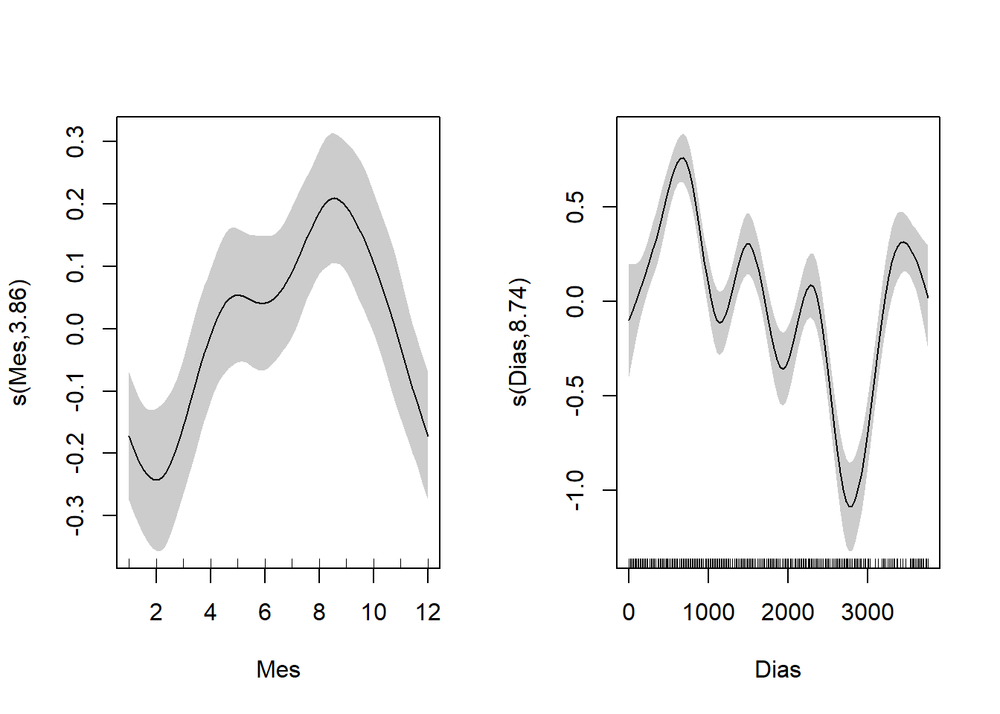
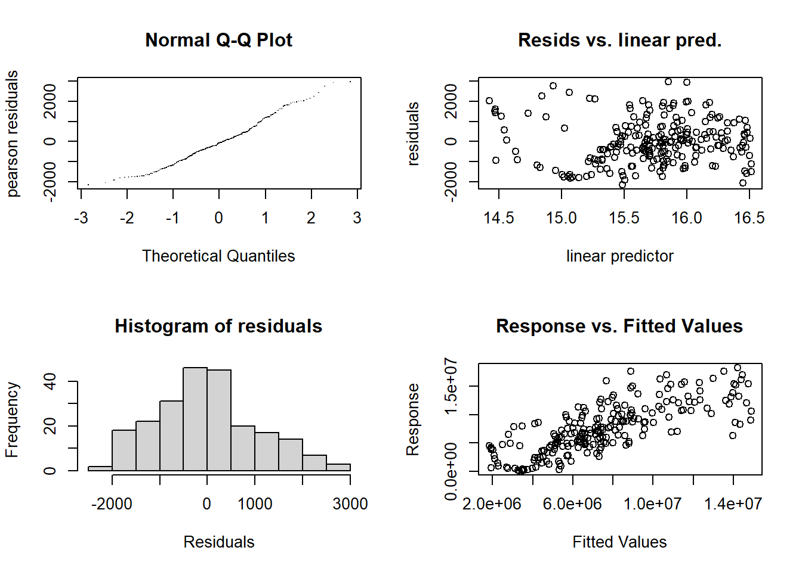
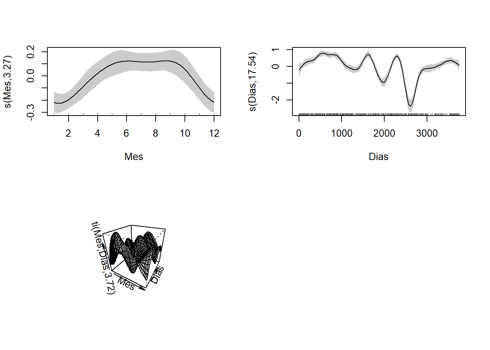
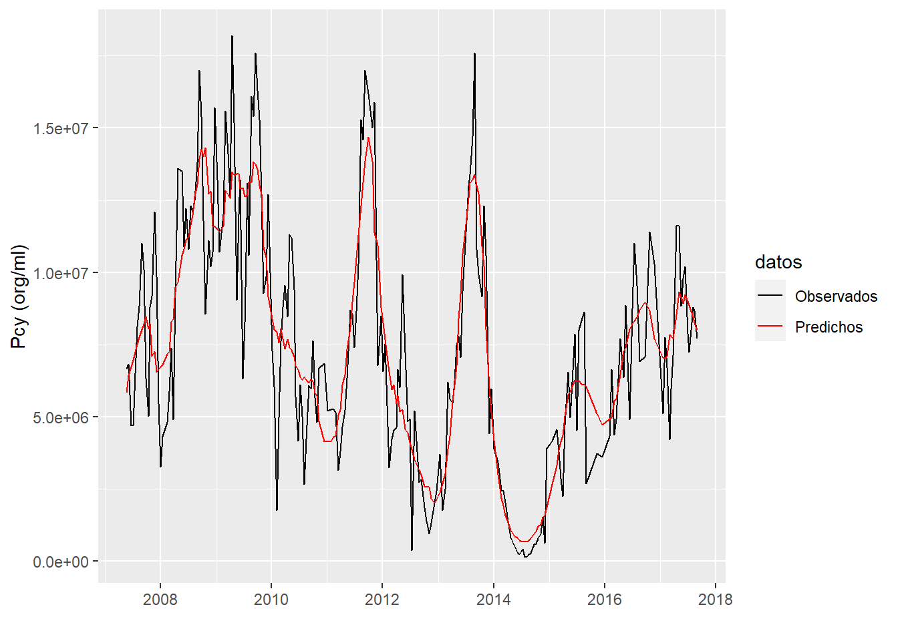

# Modelos Aditivos Generalizados {#gam}

**María Victoria Quiroga**^[mvquiroga@iib.unsam.edu.ar]

Instituto Tecnológico de Chascomús (INTECH, UNSAM-CONICET), Escuela de Bio y Nanotecnologías (UNSAM)

### Aclaración
En esta unidad se utiliza el paquete _ggplot2_ [@ggplot2] para generar algunos gráficos. Para comprender el código empleado se recomienda leer el _Capítulo 3: Data visualization_ del libro _R for Data Science_ [@wickham2017r].

## ¿Por qué usar Modelos Aditivos Generalizados (GAMs)?

1. La relación entre variables predictoras (i.e., independientes) y la variable respuesta (i.e., dependiente) **no** necesita ser **lineal**.
1. **No** necesitamos conocer de antemano la forma funcional de la relación.
1. Son modelos muy flexibles que permiten la interpretación (de manera gráfica) de los efectos parciales de cada variable independiente.
1. Podemos:
  * Incluir predictores categóricos e interacciones.
  * Usar distribuciones diferentes a la normal para la variable dependiente.
  * Incluir correlaciones entre observaciones (e.g., medidas repetidas, diseños anidados) -modelos mixtos.

## ¿Qué son los GAMs?

Los GAM permiten incorporar los efectos additivos de distintas variables independientes (i.e., explicativas) utilizando funciones suaves ($smooth functions$).

$$
g(\mu) = \beta_0 + f_{1}(x_{1}) + f_{2}(x_{2}) + ... + f_{n}(x_{n}) + \varepsilon
$$

Donde $\mu$ es el valor esperado de la variable dependiente _y_ que puede presentar distribuciones de la familia exponencial, _g_ es la función de enlace, $\beta_0$ es el intercepto, $x_{n}$ son las _n_ variables independientes y cada $f_{n}$ es una función suave que se estima de manera no paramétrica. Se pueden incluir funciones suaves para interacciones, por ejemplo entre las variables independientes 1 y 2 $f(x_{1},x_{2})$. Si se incluyen términos aditivos aleatorios, por ejemplo la autocorrelación en series de tiempo, se generan modelos mixtos (GAMM, _generalized additive mixed model_).

Existen diferentes estrategias para ajustar una curva suave y continua a los datos. Aquí vamos a utilizar _splines_, y en particular _spline_ cúbico y cúbico cíclico. De manera muy breve, un _spline_ cúbico es una curva suave cúbica por tramos (Figura \@ref(fig:Splines)). El _spline_ cúbico cíclico empieza y termina en el mismo punto. El paquete con el que vamos a trabajar _mgcv_ [@wood2017] usa splines penalizados ( _conventional intergrated square second derivative cubic spline penalty_), donde la penalización será más grande cuanto menos suave sea la curva.

<div class="figure" style="text-align: center">

<p class="caption">(\#fig:Splines)Construcción de un spline cúbico. La curva suave (línea contínua gruesa) es la suma de las 5 funciones basis (líneas finas). Las líneas verticales muestran los nodos equiespaciados. Extraído de Wood (2017).</p>
</div>

## ¡Manos a la obra!
Utilizaremos un set de datos del trabajo _The dynamics of picocyanobacteria from a hypereutrophic shallow lake is affected by light-climate and small-bodied zooplankton: a 10-year cytometric time-series analysis_ publicado en _FEMS Microbiology Ecology_ [@quiroga2021], disponibles en el [Repositorio Institucional CONICET Digital](http://hdl.handle.net/11336/200094).

Descargar el set de datos **data_gam.csv** de [GitHub Limno-con-R/CILCAL2023](https://github.com/Limno-con-R/CILCAL2023/tree/main/datasets).
Guardar el archivo en una carpeta llamada _data_, dentro del **Directorio de Trabajo** del **Proyecto** que creamos para esta Unidad (ver cómo hacerlo en la Unidad \@ref(intro)).

Instalar los paquetes como se indica en la Unidad \@ref(intro). Luego, cargarlos en la sesión


```r
library(mgcv)
library(ggplot2)
library(itsadug)
library(data.table)
library(car)
library(grid)
library(lubridate)
```

Leer datos, dar formato `as.Date` a la fecha y generar las variables `Mes` y `Dias`. 


```r
base <- read.csv("data/data_gam.csv")
base$Fecha <- as.Date(base$Fecha, "%m/%d/%Y") # formato de fecha en inglés
base$Mes <- as.numeric(format(base$Fecha,'%m')) # generar variable Mes
base$Dia1 = rep(base$Fecha[1], nrow(base)) # fecha inicial de la serie
base$Dias <- (interval(base$Dia1, base$Fecha) %/% days(1))+1 # generar variable Dias
```

Inspección visual de primeras filas de la tabla. Para ver toda la tabla se puede utilizar `View(base)`.


```r
head(base)
```

```
##        Fecha Pcy_orgml Mes       Dia1 Dias
## 1 2007-05-22   6660000   5 2007-05-22    1
## 2 2007-06-05   6830000   6 2007-05-22   15
## 3 2007-06-21   4700000   6 2007-05-22   31
## 4 2007-07-03   4680000   7 2007-05-22   43
## 5 2007-07-17   6500000   7 2007-05-22   57
## 6 2007-07-31   8110000   7 2007-05-22   71
```

Ver la estructura de los datos


```r
str(base)
```

```
## 'data.frame':	225 obs. of  5 variables:
##  $ Fecha    : Date, format: "2007-05-22" "2007-06-05" ...
##  $ Pcy_orgml: num  6660000 6830000 4700000 4680000 6500000 8110000 8840000 11000000 10100000 6340000 ...
##  $ Mes      : num  5 6 6 7 7 7 8 8 9 9 ...
##  $ Dia1     : Date, format: "2007-05-22" "2007-05-22" ...
##  $ Dias     : num  1 15 31 43 57 71 85 99 113 127 ...
```

`base` es un objeto `data.frame` con 225 `obs.` observaciones o filas y 5 `variables` o columnas.
Variables: `Fecha` con formato `Date`. `Pcy_orgml`, abundancia de picocianobacterias (organismos/ml) en la laguna Chascomús, como valores numéricos `num`.

Se generaron las variables `Mes` y `Dias` como números `num`. `Mes` indica el #mes (1-12) de la fecha de muestreo y `Dias` indica el #días transcurridos desde la primer fecha (considerando la primer fecha como día #1).

Grafico exploratorio de la serie temporal


```r
ggplot(base, aes(x= Dias, y= Pcy_orgml))  +
  geom_point()  +
  geom_line()+
  theme(legend.position = "none")
```

<div class="figure" style="text-align: center">

<p class="caption">(\#fig:serie)Serie temporal de abundancia (organismos/ml) de picocianobacterias.</p>
</div>

No se observan outliers en el gráfico.

Para datos de conteo (e.g., organismos/ml) generalmente se utiliza la distribución de Poisson, pero las series temporales de abundancia de microorganismos suelen presentar sobredispersión (Figura \@ref(fig:serie)). Para considerar una varianza mayor que la media se podría utilizar la distribución binomial negativa o la _quasi-familia_ quasipoisson. En este ejemplo se implementará `family=quasipoisson`.

La autocorrelación temporal de los datos se incluye utilizando una estructura autorregresiva de primer orden continua `correlation = corCAR1(form = ~ Dias)` en un modelo mixto `gamm()`.

Como primer modelado se generan funciones suaves `s()` para el efecto estacional `Mes` y el efecto interanual ( _trend_) `Dias`. Se utiliza _spline_ cúbico cíclico para el primer efecto `s(Mes, bs="cc")` y cúbico para el segundo efecto `s(Dias, bs="cr")`.


```r
modelo1<-gamm(Pcy_orgml ~ s(Mes, bs = "cc") + s(Dias, bs="cr"), 
              family=quasipoisson, data = base, 
              correlation = corCAR1(form = ~ Dias))
```

```
## 
##  Maximum number of PQL iterations:  20
```

```
## iteration 1
```

```
## iteration 2
```

```
## iteration 3
```

```
## iteration 4
```

Por _default_ el máximo número de iteraciones está seteado en 20 `niterPQL=20`. Si el modelo no converge se puede incrementar el número de interacciones, por ejemplo: `gamm(..., niterPQL=40)`.

Interpretación visual de los efectos parciales: curvas suaves `s()` ( _smooth functions_)


```r
plot(modelo1$gam, scale=0, scheme=1, pages=1)
```

<div class="figure" style="text-align: center">

<p class="caption">(\#fig:unnamed-chunk-6)Efectos parciales del modelo 1. Las curvas suaves se centraron en cero, se indican los intervalos de confianza de 95% en gris. Las líneas internas en los ejes x (Mes y Dias) representan los datos.</p>
</div>

Información del modelo


```r
summary(modelo1$gam)
```

```
## 
## Family: quasipoisson 
## Link function: log 
## 
## Formula:
## Pcy_orgml ~ s(Mes, bs = "cc") + s(Dias, bs = "cr")
## 
## Parametric coefficients:
##             Estimate Std. Error t value Pr(>|t|)    
## (Intercept) 15.72716    0.02977   528.2   <2e-16 ***
## ---
## Signif. codes:  0 '***' 0.001 '**' 0.01 '*' 0.05 '.' 0.1 ' ' 1
## 
## Approximate significance of smooth terms:
##           edf Ref.df      F  p-value    
## s(Mes)  3.858  8.000  3.674 3.46e-06 ***
## s(Dias) 8.743  8.743 23.752  < 2e-16 ***
## ---
## Signif. codes:  0 '***' 0.001 '**' 0.01 '*' 0.05 '.' 0.1 ' ' 1
## 
## R-sq.(adj) =  0.564   
##   Scale est. = 1.209e+06  n = 225
```

Se especifica la familia que se utilizó `## Family: quasipoisson` y la función de enlace `## Link function: log`. `?family` muestra las familias y funciones de enlace que se utilizan por _default_. Para cambiar la función de enlace solo hay que especificarlo en el código, ejemplo `family = Gamma(link = "log")`. Si no se especifica una familia, `gamm` usa distribución gaussiana con función de enlace identidad. La ayuda `?gamm` muestra todos los argumentos y los _defaults_.

Se observa que ambos términos de suavizado son significativos (`p-value` < 0.05), y el $R_{adj}^{2}$ del modelo es 0.5640034.

Evaluación del modelo


```r
windows()
par(mfrow=c(2,2))
gam.check(modelo1$gam, type="pearson")
```

<div class="figure" style="text-align: center">

<p class="caption">(\#fig:check)gam.check del modelo 1.</p>
</div>

```
## 
## 'gamm' based fit - care required with interpretation.
## Checks based on working residuals may be misleading.
## Basis dimension (k) checking results. Low p-value (k-index<1) may
## indicate that k is too low, especially if edf is close to k'.
## 
##           k'  edf k-index p-value    
## s(Mes)  8.00 3.86    0.93     0.2    
## s(Dias) 9.00 8.74    0.31  <2e-16 ***
## ---
## Signif. codes:  0 '***' 0.001 '**' 0.01 '*' 0.05 '.' 0.1 ' ' 1
```
Los gráficos de la izquierda de la Figura \@ref(fig:check) muestran que es correcto utilizar la _quasi familia_ quasipoisson. El gráfico superior derecho muestra una dispersión bastante homogénea de los residuos, por lo que no habría mayores problemas con la varianza. El gráfico inferior derecho muestra una relación lineal positiva entre los valores observados y los predichos por el modelo. Si se logra mejorar el modelo, se observará una mejoría en este gráfico y en el $R_{adj}^{2}$ del modelo.

En el modelo 1 no se especificó el `k` en los términos de suavizado `s()`, se utilizó la opción _default_ `k = 10`. Este argumento especifica la dimensión de las funciones _basis_ del _spline_. Cuando se indica un valor de `k`, este determina el máximo grado de libertad permitida para ese término del modelo. Sin embargo, los grados de libertad efectivos `edf` para cada término  los estima el modelo a través de la penalización, siendo el límite superior $k' = k - 1$. No especificar el argumento `k` equivale a indicar `k = 10`.

El `gam.check()` nos indica que el `k` del  término `s(Dias)` del modelo 1 es muy bajo (valor de `p-value` bajo y `edf` cercano a `k'`. Ver `?choose.k` para mas detalles.

Para mejorar el modelo se modifica `k`. Se disminuye `k = 6` en `s(Mes)` para evitar que incrementen los `edf` de ese término, y se aumenta `k = 20` en `s(Dias)`. Además, se agrega un término de interacción `ti()` adecuando para trabajar con variables que tienen diferentes unidades (meses _versus_ días). 


```r
modelo2<-gamm(Pcy_orgml ~ s(Mes, bs = "cc", k=6) + s(Dias, bs="cr", k=20) 
              + ti(Mes,Dias, bs=c("cc","cr")), family=quasipoisson, 
              data = base, correlation = corCAR1(form = ~ Dias))
```

```
## 
##  Maximum number of PQL iterations:  20
```

```
## iteration 1
```

```
## iteration 2
```

```
## iteration 3
```
Interpretación visual de los efectos parciales: curvas suaves `s()`( _smooth functions_)


```r
plot(modelo2$gam, scale=0, scheme=1, pages=1)
```

<div class="figure" style="text-align: center">

<p class="caption">(\#fig:unnamed-chunk-9)Efectos parciales del modelo 2. Las curvas suaves se centraron en cero, se indican los intervalos de confianza de 95% en gris. Las líneas internas en los ejes x (Mes y Dias) representan los datos.</p>
</div>

La interacción se muestra en 3D, y es difícil de interpretar visualmente. Aquí nos centramos en la interpretación visual de los efectos parciales.

Información del nuevo modelo


```r
summary(modelo2$gam)
```

```
## 
## Family: quasipoisson 
## Link function: log 
## 
## Formula:
## Pcy_orgml ~ s(Mes, bs = "cc", k = 6) + s(Dias, bs = "cr", k = 20) + 
##     ti(Mes, Dias, bs = c("cc", "cr"))
## 
## Parametric coefficients:
##             Estimate Std. Error t value Pr(>|t|)    
## (Intercept) 15.64156    0.02398   652.3   <2e-16 ***
## ---
## Signif. codes:  0 '***' 0.001 '**' 0.01 '*' 0.05 '.' 0.1 ' ' 1
## 
## Approximate significance of smooth terms:
##                 edf Ref.df      F p-value    
## s(Mes)        3.268   4.00  9.085  <2e-16 ***
## s(Dias)      17.539  17.54 28.940  <2e-16 ***
## ti(Mes,Dias)  3.718  12.00  0.595  0.0395 *  
## ---
## Signif. codes:  0 '***' 0.001 '**' 0.01 '*' 0.05 '.' 0.1 ' ' 1
## 
## R-sq.(adj) =  0.753   
##   Scale est. = 5.8774e+05  n = 225
```

Los efectos parciales de `s(Mes)` y `s(Dias)` son significativos, y la interacción `ti(Mes,Dias)` es significativa. El $R_{adj}^{2}$ del modelo aumentó a 0.7532274.

Evaluación del modelo


```r
windows()
par(mfrow=c(2,2))
gam.check(modelo2$gam, type="pearson")
```

<div class="figure" style="text-align: center">

<p class="caption">(\#fig:check2)gam.check del modelo 2.</p>
</div>

```
## 
## 'gamm' based fit - care required with interpretation.
## Checks based on working residuals may be misleading.
## Basis dimension (k) checking results. Low p-value (k-index<1) may
## indicate that k is too low, especially if edf is close to k'.
## 
##                 k'   edf k-index p-value    
## s(Mes)        4.00  3.27    0.84   0.025 *  
## s(Dias)      19.00 17.54    0.66  <2e-16 ***
## ti(Mes,Dias) 12.00  3.72    0.89   0.035 *  
## ---
## Signif. codes:  0 '***' 0.001 '**' 0.01 '*' 0.05 '.' 0.1 ' ' 1
```

De nuevo, parece correcto utilizar la _quasi familia_ quasipoisson, sin mayores problemas con la varianza. La relación lineal positiva entre los valores observados y los predichos (gráfico inferior derecho) ha mejorado, coincidiendo con el incremento del $R_{adj}^{2}$ del modelo.

Los `edf` del término `s(Mes)` son cercanos a 3, muy similares al primer modelo, lo cual corrobora que la especificación de k en el modelo no es crítica (modelo 1 `k = 10`, modelo 2 `k = 6`), siempre que se considere un límite superior adecuado. Para `s(Dias)` el p-value sigue siendo bajo y `edf` sigue cercano a `k'`, pero `k-index` aumentó a 0.66. Se considera que no es necesario aumentar el `k` porque complejizaría el modelo, y consecuentemente la interpretación visual de la tendencia ( _trend_, efecto Dias).

Se pueden comparar ambos modelos estimando su AIC


```r
AIC(modelo1$lme,modelo2$lme)
```

```
##             df      AIC
## modelo1$lme  6 311.8362
## modelo2$lme  8 228.2012
```

Efectivamente el modelo 2 presenta un AIC más bajo.


**Otros gráficos**

Se puede graficar con `vis.gam()`.


```r
vis.gam(modelo2$gam, type="response", 
        view=c("Mes","Dias"), main="Pcy (org/ml)",
        plot.type = "contour", contour.col="black",color="terrain")
points(base$Mes,base$Dias,pch = 20) #agregar puntos de muestreo
```

<div class="figure" style="text-align: center">

<p class="caption">(\#fig:unnamed-chunk-12)vis.gam plot del modelo 2.</p>
</div>

Se pueden graficar los valores observados a campo y los predichos por el modelo. Cuanto mas alto sea el $R_{adj}^{2}$, mas similares serán ambos valores. 


```r
# generar datos para el gráfico 
Base<-as.data.table(base) 
datas <- rbindlist(list(Base[, .(Pcy_orgml, Fecha)], 
                        data.table(Pcy_orgml = (modelo2$gam)$fitted.values,
                                   Fecha = Base[, Fecha])))
datas[, datos := c(rep("Observados", nrow(Base)), 
                  rep("Predichos", nrow(Base)))]

# generar el gráfico
ggplot(data = datas, aes(Fecha,Pcy_orgml, group = datos))+
  geom_line(aes(colour = datos))+
  scale_color_manual(values=c("black","red"))+
  labs(x = "", y = "Pcy (org/ml)")
```




## Agradecimientos
Un agradecimiento muy especial para los Profesores **Gerardo Cueto** y **Adriana Pérez** de la FCEN-UBA.
