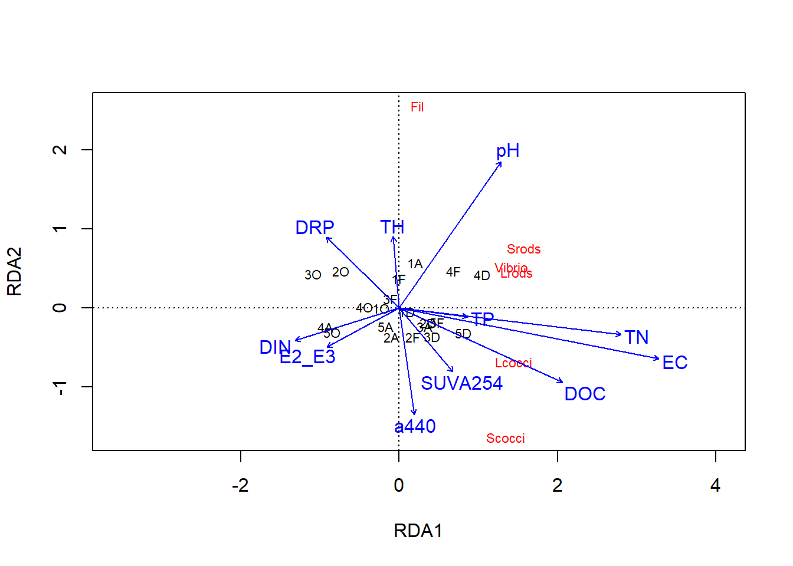
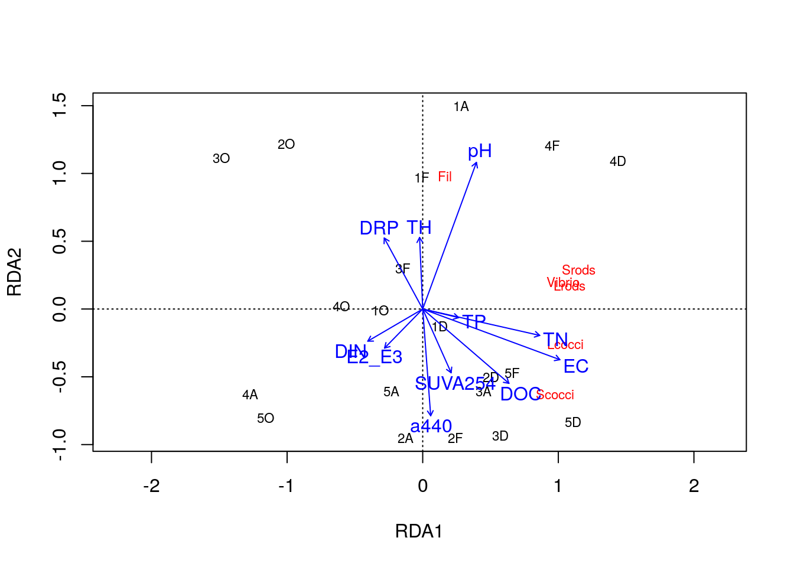
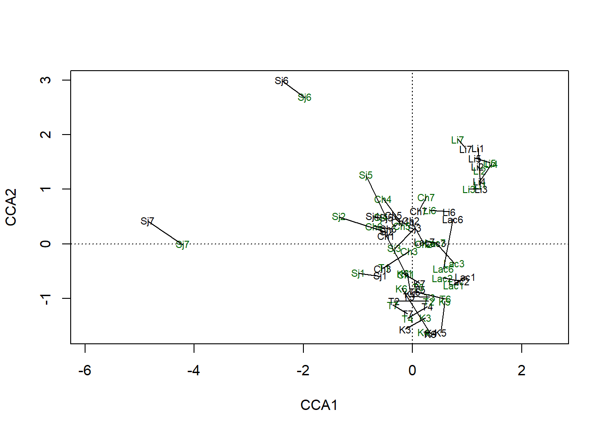
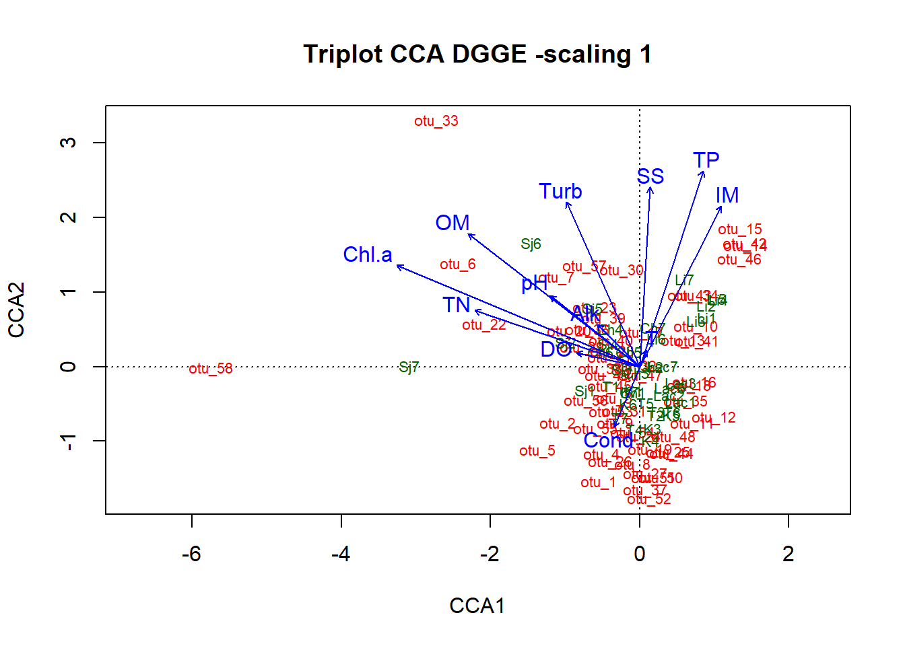

# Análisis multivariados II {#multi2}
**TECNICAS DE ORDENACION CANONICA**

**Maria Eugenia del R. Llames**^[mariaellames@intech.gov.ar]

Instituto Tecnológico de Chascomús (INTECH, UNSAM-CONICET), Escuela de Bio y Nanotecnologías (UNSAM)

## Introducción

El supuesto principal de cualquier técnica de ordenación es que los datos analizados son redundantes, es decir, contienen más variables (y dimensiones) de las necesarias para describir la información subyacente, y podemos reducir el número de estas dimensiones sin perder demasiada información. Por ejemplo, en el caso de los datos de composición de especies, algunas de las especies suelen ser ecológicamente similares (por ejemplo, especies que prefieren crecer en un hábitat húmedo en lugar de seco), lo que significa que el conjunto de datos contiene varias variables redundantes (especies) que cuentan la misma historia. O, para explicar la redundancia de otra manera, a partir de la presencia de una especie, a menudo podemos predecir la presencia de varias otras especies. En el caso de la ordenación aplicada en la matriz de variables ambientales, estas a menudo se correlacionan entre sí (por ejemplo, las mediciones del temperatura del agua a menudo se relacionan con las concentraciones de oxígeno disuelto), lo que también permite la reducción de la dimensión.

Dado que el espacio multidimensional no es fácil de mostrar, describir o simplemente imaginar, vale la pena reducirlo a unas pocas dimensiones principales, conservando al máximo la información. Esto también significa que si las variables individuales son completamente independientes entre sí (por ejemplo, cada especie tiene preferencias completamente diferentes), entonces es probable que la ordenación no encuentre una reducción razonable del espacio multidimensional.

Lo que hace el método de ordenación se puede formular de dos maneras alternativas:(i) busca gradientes en la composición de especies (representados generalmente por ejes de ordenación) e intenta explicar estos gradientes por variables ambientales; y/o (ii) busca la distribución de muestras en un espacio de ordenación reducido que refleje al máximo la disimilitud (= distancia) entre muestras en términos de su composición de especies.

De acuerdo al apartado anterior (**Unidad 4**), las técnicas allí presentadas permiten el análisis de una única matriz de datos de forma tal de revelar su estructura a través de un grafo construido con un conjunto reducido de ejes ortogonales (*i.e* independientes) Las variables externas que pueden estar influenciando esta estructura sólo podrán ser consideradas después del cómputo de la ordenación. De acuerdo con esta caracterísitica, se las conocen como "técnicas de ordenación indirecta" en donde uno deja que la matriz de datos exprese las relaciones entre objetos y variables sin restricción ("*unconstrained analyses*"). Por lo tanto es una forma pasiva de análisis, y el usuario interpreta los resultados de la ordenación *a posteriori*.

Las técnicas de **ordenación canónica**, por el contrario, permiten asociar dos o más conjuntos de datos en el propio proceso de ordenación. Típicamente,en ecología, estas matrices la constituyen una matriz de datos biológicos, como por ejemplo, relevamiento de especies en diferentes sitios (matriz de "respuesta") y su matriz ambiental asociada (matriz "explicativa") (Figura 1). 

<image src="./images/Figura 1.jpg">
**Figura 1:** *Esquema de las matrices utilizadas comúnmente en estudios ecológicos*

En este contexto, las técnicas de ordenación canónicas se engloban dentro de las "técnicas de ordenación directa" y permiten analizar patrones entre un conjunto de datos que están relacionadas con (o pueden ser interpretadas por) otro conjunto de datos, y/o probar formalmente hipótesis estadísticas sobre la importancia de estas relaciones. En otras palabras, las técnicas de ordenación canónica exploran explícitamente las relaciones entre dos matrices: una matriz de respuesta y una matriz explicativa y ambas matrices son utilizadas en la producción de la ordenación. Son análisis "restringidos" o "*constrained analyses*" (Figura 2). 

<image src="./images/Figura 2.jpg">
**Figura 2:** *Esquema de "funcionamiento" de las técnicas de ordenación canónicas.*

## La lógica de las técnicas de ordenación restringida o canónica ("constrained", análisis de gradiente directo)

Los ejes de ordenación están limitados/restringidos por factores ambientales. Relaciona la composición de especies directamente con las variables ambientales y extrae la variación en la composición de especies que está directamente relacionada con el medio ambiente. Las variables ambientales ingresan directamente al algoritmo, y los ejes de ordenación restringidos corresponden a las direcciones de la variabilidad en los datos que se explica por estas variables ambientales. El método generalmente se usa como análisis confirmatorio, es decir, puede probar las hipótesis sobre la relación entre los factores ambientales en la composición de especies (a diferencia de la ordenación sin restricciones, que es exploratoria). Descompone la varianza total en los datos de composición de especies en una fracción explicada por variables ambientales (relacionadas con ejes de ordenación restringidos) y no explicada por variables ambientales (relacionadas con ejes de ordenación no restringidos). Ofrece varias oportunidades interesantes cuando se trata de variables explicativas: permite selección directa (la selección de variables ambientales importantes mediante la exclusión de aquellas que no son relevantes para la composición de especies), habilita la prueba de permutación de Monte Carlo (una prueba de significancia de la varianza explicada por factores ambientales) y permite el análisis de la partición de la varianza (partición de la varianza explicada por diferentes grupos de variables ambientales).

### ¿Qué tipo de datos de composición de especies se utilizan para el análisis?

#### (a) Métodos basados en datos brutos (enfoque clásico)

Métodos basados en el análisis de matrices crudas de muestras-especies con datos de abundancia o presencia/ausencia. Dentro de estos métodos, se reconocen tradicionalmente dos categorías, que se diferencian por la suposición de la respuesta de las especies a lo largo del gradiente ambiental: 

1. **lineal** (Figura 3, panel izquierdo): supone que las especies responden linealmente a lo largo del gradiente ambiental, lo que podría ser cierto para datos ecológicos bastante homogéneos, y esto se da cuando donde los gradientes ecológicos considerados son bastante cortos;

2.**unimodal** (Figura 3, panel derecho): respuesta de la especie unimodalmente a lo largo del gradiente, con su punto óptimo en una determinada posición del gradiente; este modelo se acerca más a la realidad de los datos ecológicos y es más adecuado para conjuntos de datos heterogéneos (estructurados por un gradiente ecológico fuerte o largo, con un alto recambio de especies y muchos ceros en la matriz de especies), es decir, análisi de gradientes ambientales bastante largos.

<image src="./images/Figura 3.jpg">

**Figura 3:** *Supuesto de respuesta lineal (izquierda) frente a unimodal (derecha) del "fitness"/abundancia de las especies a lo largo del medio ambiente.Fuente <https://www.davidzeleny.net/anadat-r/doku.php/en:ordination>*


#### (b) Métodos aplicados sobre datos transformados

Todos los métodos de ordenación tienen implícito un paso de cálculo de índices de distancia en su algoritmo. En algunos casos, tenemos la opción de indicarle al algoritmo qué índice utilizar (ejemplo: PCoA o NMDS), mientras que en otros el índice utilizado es fijo (ejemplo: PCA, RDA). Lo que tenemos que tener en cuenta es que, entre todos los índices posibles, existen índices "*simétricos*" (incluyen el doble cero en el cálculo del índice), e índices "*asimétricos*" (no incluyen al doble cero en el cálculo del índice). La utilización de índices símetricos en análisis de ordenación que suponen respuesta lineal pueden llevar a la paradoja de que dos sitios se "ordenen cercanos" en base a la ausencia de especies en ambos sitios (para más detalle sobre este punto, referirse al Capítulo 7 de libro "Numerical Ecology" de Legendre & Legendre, 2012). En aquellos casos en que el modelo a aplicar es de respuesta lineal y se base en el cálculo de índices simétricos, se recomienda transformar los datos de composición de especies de forma tal de adecuar los datos ecológicos y evitar caer en la paradoja del doble-cero. En este sentido, Legendre y Gallagher (2001) detallan diversas transformaciones adecuadas para la aplicación de métodos de ordenación que asumen respuesta lineal.

#### (c) Métodos basados en la distancia

Métodos que utilizan la matriz de distancias entre muestras medidas por coeficientes de distancia y que proyectan estas distancias en diagramas de ordenación de dos o más dimensiones. El método se conoce como db-RDA (RDA basado en la distancia) y consiste en una combinación de PCoA, aplicada en datos sin procesar utilizando una medida de distancia seleccionada, y RDA aplicada en los autovectores resultantes de PCoA (ver más abajo). Ofrece una alternativa a RDA (basada en distancias euclidianas) y  al RDA basado en datos transformados (por ejemplo, transformados por Hellinger), con la libertad de elegir la medida de distancia adecuada para los datos investigados.

### ¿Cómo saber si debo utilizar un método de ordenación de respuesta lineal o unimodal?

Para decidir si aplicar el método de ordenación de respuesta lineal o unimodal en los datos, podemos basarnos en la regla general introducida por Lepš & Šmilauer (2003): primero, calcule DCA ("Detrended correspondence analysis"-análisis sin tendencia por segmentos) en sus datos y verifique la longitud del primer Eje del DCA (que está escalado en unidades de desviación estándar, S.D.). Una longitud del primer eje DCA > 4 S.D. indica un conjunto de datos heterogéneo en el que se deben utilizar métodos unimodales, mientras que la longitud < 3 S.D. indica un conjunto de datos homogéneo para el cual los métodos lineales son adecuados. En la zona gris entre 3 y 4 S.D., tanto los métodos lineales como los unimodales son adecuados. Sin embargo, tengan en cuenta que si bien **los métodos lineales no deben usarse para datos heterogéneos** (*i.e.* para datos de respuesta unimodal), los métodos unimodales pueden ser usados para datos homogéneos, no obstante, los métodos lineales, en este caso, son más poderosos y deberían ser preferidos. 
Alternativamente, si tus datos de composición de especies son heterogéneos, pero aún querés utilizar algún método de ordenación lineal (PCA, RDA), recordá trasnformar estos datos de composición de especies de forma tal de evitar el problema del doble-cero. 


## Análisis de Redundancia (RDA)

El RDA es un método que combina las técnicas de regresión lineal con el análisis de componentes principales (PCA). Por un lado, es una extensión directa del análisis de regresión múltiple para modelar la respuesta multivariada de datos. *Redundancia* es sinónimo de "variación explicada" y se interpreta de la misma manera que como lo aprendieron en sus cursos introductorios de Estadísitica al estudiar los modelos de análisis univariados. El análisis se dice *asimétrico* (*i.e.* se establece una matriz de respuesta y una matriz explicativa), en donde la matriz "Y" (biológica) corresponde a la variable multidimensional de respuesta y "X" (o "E", de acuerdo a la Figura 1), corresponde a la matriz multidimensional de variables explicativas. Desde una perspectiva descriptiva, uno diría que la ordenación de "Y" está *restringida* de forma tal que los vectores de ordenación resultantes son combinaciones lineales de las variables en "X".

>Por otro lado, RDA también puede verse como una extensión del análisis de componentes principales (PCA), porque los vectores de ordenación canónica que resultan constituyen combinaciones lineales de las variables de respuesta "Y". Esto significa que cada vector de ordenación es una proyección unidimensional de la distribución de los objetos en un espacio que conserva las distancias euclidianas entre ellos. 

Rápidamente, este método busca, en orden sucesivo, una serie de *combinaciones lineales* de las *variables explicativas* que *mejor explican* la *variación* de los datos de la matriz de *variable respuesta*. Los *ejes* definidos en el espacio a partir de la matriz de las variables explicativas son *ortogonales* entre sí (*i.e* independientes). RDA es por lo tanto un *procedimiento de ordenación restringida*. La diferencia con la ordenación sin restricciones es importante: la matriz de variables explicativas condiciona los “pesos” (*i.e.* autovalores, valores propios o *eigenvalues*) y las direcciones de los ejes de ordenación. En RDA, uno puede decir verdaderamente que los ejes explican o modelan (en el sentido estadístico) la variación de la matriz respuesta o dependiente.

Como resultado, la variación en la composición de especies se descompone en variación relacionada con variables ambientales (representadas por ejes restringidos/canónicos, autovectores o *eigenvectors*) y no relacionada con variables ambientales (ejes no restringidos). El número total de ejes canónicos generdados corresponde a la cantidad *min [p, m, n-1]*. Es decir, la cantidad de ejes será el número más bajo entre los parámetros *p*, *m*, y *(n-1)*, talque *(i)* la cantidad de ejes generados no puede exceder *p* que es el tamaño del espacio de referencia de la matriz "Y" (*i.e.* número de variables respuesta cosnideradas, de especies para nuestro caso); *(ii)* no puede exceder *m* que es el número de variables en X (cantidad de variables ambientales consideradas) y *(iii)* no puede exceder (n – 1), que es el número máximo de dimensiones requeridas para representar *n* puntos (*i.e.* sitios) en el espacio euclidiano. Finalmente, la significancia estadística del modelo de RDA (modelo global) y la de los ejes canónicos se pueden probar mediante análisis permutacionales (no paramétricos).


## Caso de estudio

### Analicemos estos aspectos a través de un ejemplo práctico...

Utilizaremos un set de datos del trabajo *Bacterioplankton morphotypes structure and cytometric fingerprint rely on environmental conditions in a sub-Antarctic peatland* publicado en *Hydrobiologia* (Quiroga *et al.* 2017), disponibles en el [Repositorio Institucional](http://hdl.handle.net/11336/201811) [CONICET Digital](http://hdl.handle.net/11336/201874). Para ello, descargar el set de datos **morpho_biomass.csv** y **chem.csv** de [GitHub Limno-con-R/CILCAL2023](https://github.com/Limno-con-R/CILCAL2023/tree/main/datasets).
Guardar los archivos en una carpeta llamada _data_, dentro del **Directorio de Trabajo** del **Proyecto** que creamos para esta Unidad (ver cómo hacerlo en la Unidad \@ref(intro)). Finalmente, instalar los paquetes como se indica en la Unidad \@ref(intro). Luego, cargarlos en la sesión. 

### RDA utilizando el paquete **vegan** (Oksanen *et al.*, 2007)


```r
library (vegan)
```

```
## Warning: package 'vegan' was built under R version 4.2.3
```

```
## Loading required package: permute
```

```
## Loading required package: lattice
```

```
## This is vegan 2.6-4
```

```r
data_biomass <-read.csv("./data/morpho_biomass.csv",row.names=1) # biomasa [pgC/mL]
biomass <-data_biomass[,4:9] #selecciono solo los datos de biomasa de los diferentes morfotipos de la matriz de datos biologicos
bio.trans <-log10(biomass+1) # transformacion log10(x+1). Esta transformación se utiliza para estabilizar varianzas. Si tengo un grupo extremadamente dominante y otros menos representados, es una buena opción. Más detalle sobre transformaciones pueden encontrar en la biblio del curso. 
```


```r
# Cómputo del DCA para verificar la longitud del gradiente
#----

vare.dca <- decorana(bio.trans)
vare.dca
```

```
## 
## Call:
## decorana(veg = bio.trans) 
## 
## Detrended correspondence analysis with 26 segments.
## Rescaling of axes with 4 iterations.
## Total inertia (scaled Chi-square): 0.109 
## 
##                         DCA1     DCA2      DCA3      DCA4
## Eigenvalues          0.07139 0.005130 0.0020470 0.0012492
## Additive Eigenvalues 0.07139 0.008798 0.0117827 0.0154503
## Decorana values      0.10595 0.001355 0.0005076 0.0002615
## Axis lengths         0.60193 0.239784 0.1647616 0.1281498
```
La última línea de la primer columna (DCA1) indica *Axis lengths= 0.60193*. Ese valor corresponde a la longitud del primer eje de ordenamiento del DCA, expresado en unidades de desvio estándar (S.D.) de recambio de especies. Un gradiente mayor a 4 S.D. indica que algunas especies presentan respuesta unimodal. En el caso de nuestr ejemplo, la longitud del gradiente es < 4, indicando un gradiente homogéneo o corto y, por lo tanto, el modelo de respuesta lineal es el adecuado para aplicar.
Procedemos, entonces, al modelado a través de un RDA:


```r
# RDA
#----
# Seleccion de variables explicativas
ambiental <-read.csv("./data/chem.csv", row.names=1) #cargo las variables ambientales
env <- ambiental[,c(4:5,7:15)] # saco una de ellas: "DO" (oxígeno disuelto) ya que tiene datos faltantes (NAs) y el modelo no corre con variables que tengan datos faltantes
```

Hasta acá, hemos (i) verificado el tipo de respuesta en nuestros datos de composición de especie para elegir el modelo adecuado y (ii) preparamos los datos de composición y de datos ambientales para modelar.
Además del tipo de respuesta, otro requisito necesario es la "multinormalidad" de los datos de la matriz ambiental. En el siguiente paso, lo que vamos a hacer es chequear que este supuesto se cumpla:


```r
#Chequeo de normalidad de los datos en la amtriz ambiental
library(MVN)
mvn.env <- mvn(env, mvnTest = "mardia")
mvn.env$Descriptives$Skew # skwe < 2 
```

```
##  [1]  0.7514272 -0.8963630  0.3566289  0.4353447  0.6865369  0.1131861
##  [7]  1.5255447  0.7839304  0.4965284  0.3858427 -0.2629160
```

```r
mvn.env$multivariateNormality$`p value`#p-valores > 0.05, no tenemos evidencia para rechazar la multinomralidad de los datos. 
```

```
## [1] 0.854080999478208 0.186705671286224 <NA>             
## Levels: 0.854080999478208 0.186705671286224
```
En este caso, elegimos analizar la asimetría de los datos ("*skewness*") a través del estudio de la significancia de los coeficiente de asimetría y curtosis multivariado de Mardia. Para la normalidad multivariada, los valores *p* de las estadísticas de asimetría y curtosis deben ser superiores a 0,05. Si el tamaño de la muestra es inferior a 20, se debe utilizar *p.value.small* como valor significativo de asimetría en lugar de *p.value.skew*. 

Con los supuestos del modelo revisados y comprobados, avanzamos con la aplicación del modelo a los datos. En el caso del paquete **vegan**, permite el cálculo de una RDA de dos maneras diferentes. La sintaxis más simple es listar los nombres de los marcos de datos involucrados separados por comas:


```r
simpleRDA <- rda(bio.trans, env)
```

Esta manera, si bien es sencilla, tiene algunas limitaciones. Su principal inconveniente es que no permite incluir variables cualitativas en la matriz explicativa. Por lo tanto, en todas las aplicaciones excepto en las más simples, es mejor usar la interfaz de la fórmula:


```r
biomass.rda<-rda(bio.trans ~ ., data= env, scale=TRUE )#dado que las variables #ambietnales son dimensionalmente heterogéneas, debemos escalar los datos a una #distribución normal, de media cero y varianza 1 ( N~(0,1))
#Observación: Observá el atajo (.) para indicarle a la función que use todas las #variables presentes en la matriz env
summary (biomass.rda)
```

```
## 
## Call:
## rda(formula = bio.trans ~ pH + EC + TH + DOC + DIN + TN + DRP +      TP + a440 + SUVA254 + E2_E3, data = env, scale = TRUE) 
## 
## Partitioning of correlations:
##               Inertia Proportion
## Total           6.000     1.0000
## Constrained     4.657     0.7762
## Unconstrained   1.343     0.2238
## 
## Eigenvalues, and their contribution to the correlations 
## 
## Importance of components:
##                         RDA1   RDA2    RDA3    RDA4     RDA5     RDA6    PC1
## Eigenvalue            3.1710 0.8844 0.33988 0.21332 0.033907 0.014628 0.6473
## Proportion Explained  0.5285 0.1474 0.05665 0.03555 0.005651 0.002438 0.1079
## Cumulative Proportion 0.5285 0.6759 0.73256 0.76811 0.773762 0.776200 0.8841
##                           PC2     PC3      PC4      PC5       PC6
## Eigenvalue            0.36127 0.23664 0.058178 0.035203 0.0042519
## Proportion Explained  0.06021 0.03944 0.009696 0.005867 0.0007087
## Cumulative Proportion 0.94429 0.98373 0.993424 0.999291 1.0000000
## 
## Accumulated constrained eigenvalues
## Importance of components:
##                         RDA1   RDA2    RDA3   RDA4     RDA5     RDA6
## Eigenvalue            3.1710 0.8844 0.33988 0.2133 0.033907 0.014628
## Proportion Explained  0.6809 0.1899 0.07298 0.0458 0.007281 0.003141
## Cumulative Proportion 0.6809 0.8708 0.94377 0.9896 0.996859 1.000000
## 
## Scaling 2 for species and site scores
## * Species are scaled proportional to eigenvalues
## * Sites are unscaled: weighted dispersion equal on all dimensions
## * General scaling constant of scores:  3.26758 
## 
## 
## Species scores
## 
##          RDA1    RDA2    RDA3     RDA4     RDA5      RDA6
## Fil    0.1640  0.9800  0.1229 -0.36682  0.01563  0.006191
## Lrods  1.0807  0.1722  0.1353  0.21391  0.04241  0.124300
## Vibrio 1.0330  0.1990 -0.3880  0.10220  0.14806 -0.061658
## Lcocci 1.0518 -0.2601  0.5923 -0.01995  0.02843 -0.065814
## Srods  1.1491  0.2899 -0.1576  0.12975 -0.18794 -0.032996
## Scocci 0.9769 -0.6264 -0.2126 -0.41426 -0.01565  0.036324
## 
## 
## Site scores (weighted sums of species scores)
## 
##         RDA1     RDA2      RDA3     RDA4      RDA5     RDA6
## 1O -0.315023 -0.01150 -0.135348  1.83690  1.989508  2.36638
## 2O -1.007735  1.21914  0.282566  0.40541  2.088730  1.04932
## 3O -1.484836  1.11482  1.265037 -1.32407 -1.594090 -0.24504
## 4O -0.600298  0.02235 -0.719724  1.50242 -0.090550  1.60198
## 5O -1.158091 -0.80220  1.212587 -0.40025 -1.467472 -0.72606
## 1D  0.125647 -0.12541 -0.241248  1.54171  0.244519 -2.25780
## 2D  0.503364 -0.50115  0.265594  0.84928 -1.481579  0.48143
## 3D  0.571223 -0.93323  0.477569 -0.33140 -3.801358 -1.22805
## 4D  1.440168  1.09255 -0.009618 -1.21473 -1.730754  2.44805
## 5D  1.110690 -0.83129  1.491267  0.91641  5.229787 -0.65145
## 1F -0.004785  0.97072  0.213935 -0.49315  0.297806 -4.20914
## 2F  0.243819 -0.95176 -0.343644 -0.70321 -1.449543 -1.28073
## 3F -0.145507  0.29996  0.622884 -2.30409 -2.203613  4.03065
## 4F  0.955108  1.20742  0.102013  0.23464  0.302300  0.83304
## 5F  0.660170 -0.47342 -0.933551  0.65107  0.249799 -0.36565
## 1A  0.284992  1.49562 -0.243656  0.11548  0.300082  0.24773
## 2A -0.126578 -0.94884  0.028396 -0.58969  1.471159  0.03331
## 3A  0.450376 -0.60836 -1.317999  0.08787  0.958064 -0.96982
## 4A -1.273194 -0.62696 -1.942517 -0.96279  0.691910 -1.54544
## 5A -0.229511 -0.60848 -0.074542  0.18221 -0.004706  0.38729
## 
## 
## Site constraints (linear combinations of constraining variables)
## 
##         RDA1     RDA2     RDA3     RDA4     RDA5     RDA6
## 1O -0.666050 -0.03263 -0.20456  0.67067  0.30973  1.13043
## 2O -0.589321  0.88879 -0.19113  1.06969  0.83522  0.07651
## 3O -1.147534  0.65602  0.97820 -0.32919 -0.63364  0.64437
## 4O -0.541377  0.06784  0.30905  0.83005 -0.34576  0.49226
## 5O -1.367806 -0.60884  0.89670  0.09781  0.20458  0.29427
## 1D  0.009829  0.05750 -0.08803  1.53774  0.90167 -1.38061
## 2D -0.051073  0.14523  0.39871  0.09523 -1.36220  0.16740
## 3D  0.791745 -0.67157  0.49123  0.56383 -1.01736 -1.11073
## 4D  1.402806  0.76775 -0.20109 -0.26664  1.09996  0.76278
## 5D  0.750646 -0.79242  1.44929 -0.54727  0.84634 -0.33252
## 1F  0.188119  0.86592  0.35285 -0.64724  0.05688 -0.77830
## 2F  0.543423 -0.25688 -0.09422 -0.22587  0.52622  1.29148
## 3F -0.217915 -0.65881  0.07894 -1.19060  0.10541 -0.28021
## 4F  1.014708  0.75753 -0.24087  0.08763 -1.74999  0.36433
## 5F  0.318650 -0.94261 -1.09939  0.29612  0.09228  0.31852
## 1A -0.073515  1.77741 -0.15026 -0.49096  0.29268 -0.96792
## 2A  0.288515 -0.54700  0.59304 -0.89605  0.35509  0.05141
## 3A  0.419385 -0.12031 -1.15996 -0.05880 -0.12945  0.59023
## 4A -1.205438 -0.29740 -1.70082 -1.29957 -0.08222 -0.77949
## 5A  0.132203 -1.05551 -0.41768  0.70342 -0.30544 -0.55421
## 
## 
## Biplot scores for constraining variables
## 
##             RDA1     RDA2     RDA3      RDA4     RDA5      RDA6
## pH       0.24581  0.67115 -0.41787 -0.003153  0.13921 -0.281524
## EC       0.62762 -0.23182 -0.44280 -0.411541 -0.22997 -0.241235
## TH      -0.01424  0.32740 -0.10029  0.266745 -0.02467 -0.130398
## DOC      0.39463 -0.34017  0.01318 -0.137529 -0.02881 -0.475663
## DIN     -0.25130 -0.14701 -0.40052  0.175035  0.16676  0.188011
## TN       0.53545 -0.12080  0.01779 -0.644442  0.25086 -0.011189
## DRP     -0.17603  0.32493  0.29212 -0.201619  0.04890  0.152063
## TP       0.16442 -0.03934 -0.66674 -0.027193 -0.13282 -0.005328
## a440     0.03653 -0.48845 -0.66818 -0.233564 -0.24154 -0.272376
## SUVA254  0.13008 -0.29171 -0.27511  0.019930 -0.30331  0.359999
## E2_E3   -0.17459 -0.17869 -0.06789  0.162049  0.09327 -0.451209
```

```r
# Coeficientes canónicos 
coef(biomass.rda)
```

```
##                  RDA1          RDA2          RDA3          RDA4          RDA5
## pH       2.152488e-02  1.592068e-01 -1.762663e-02  6.615200e-02 -6.710379e-02
## EC       2.531088e-02  7.981753e-04 -1.679251e-02 -1.075705e-02 -1.256239e-02
## TH      -6.176966e-03  1.827047e-02 -6.753879e-03 -1.236731e-02 -9.362529e-03
## DOC      3.715987e-02  1.313701e-02  5.364947e-02  4.154162e-02 -7.030470e-02
## DIN     -4.111146e-04 -1.983296e-04 -4.529877e-03  1.006686e-04  4.049021e-03
## TN       7.788896e-06 -1.510186e-05 -8.793536e-06 -4.098084e-05  9.646049e-05
## DRP     -5.590659e-03  8.149917e-03  1.649684e-03 -8.282799e-03 -9.950571e-03
## TP       2.128018e-03  1.801153e-04 -1.587443e-03  2.700815e-03  2.960609e-03
## a440    -1.459099e-01  2.398457e-03 -1.904511e-02 -1.356861e-01 -1.003461e-01
## SUVA254  4.905131e-02 -9.475625e-03  2.433850e-02  7.493413e-02 -8.659162e-02
## E2_E3    4.729434e-02 -2.018131e-01 -1.164860e-01  2.563431e-01  5.309020e-01
##                  RDA6
## pH      -2.039089e-01
## EC       2.933565e-02
## TH       7.262698e-03
## DOC     -5.807067e-02
## DIN      6.838714e-03
## TN       1.385058e-05
## DRP      1.061373e-03
## TP       6.682286e-04
## a440    -8.433608e-02
## SUVA254  3.630886e-02
## E2_E3   -8.524522e-02
```

```r
## Test Global para el RDA con todas las variables
```


```r
anova(biomass.rda, permutations = how(nperm = 999))#nada tiene que ver este análisis #con el tradicional "ANOVA"de la estadística univariada...
```

```
## Permutation test for rda under reduced model
## Permutation: free
## Number of permutations: 999
## 
## Model: rda(formula = bio.trans ~ pH + EC + TH + DOC + DIN + TN + DRP + TP + a440 + SUVA254 + E2_E3, data = env, scale = TRUE)
##          Df Variance      F Pr(>F)  
## Model    11   4.6572 2.5224  0.017 *
## Residual  8   1.3428                
## ---
## Signif. codes:  0 '***' 0.001 '**' 0.01 '*' 0.05 '.' 0.1 ' ' 1
```

```r
#R^2
(R2 <- RsquareAdj(biomass.rda)$r.squared)# 0.78
```

```
## [1] 0.7762
```

```r
#el R^2, al igual que ocurre en la regresión múltiple, está "inflado" por la cantidad #de variables incluidas en el mdoelo, es decir, aumenta al incluir más variables, #independientemente de que exista una relación o nó entre ellas y la matriz respuesta. #Además, la acumulación de variables explicativas infla la cantidad aparente de #varianza explicada como consecuencia de correlaciones aleatorias entre variables. Este #problema se puede solucionar ajustando el R^2


# R^2 ajustado (penalizado por la cantidad de variables incluidas en le modelo, mide la #cantidad de variación explicada "sin sesgo") 
(R2adj <- RsquareAdj(biomass.rda)$adj.r.squared)
```

```
## [1] 0.4684749
```

```r
#0.47
```
Expliquemos un poco esta salida...
En primer lugar, se revisa la prueba global del modelo utilizando todas las variables explicativas (resultado de la función *anova*). Si, y solo si, la prueba global es significativa, se puede proceder con la selección de variables (más abajo). 
La salida anterior porporciona información útil: "*Inertia*" (Inercia) es otro nombre para variación o varianza en este caso. "*Total*" se refiere a la varianza total, "*Constrained*" (Restringida) se refiere a la cantidad de varianza explicada por las variables explicativas, "*Unconstrainded*" (Sin restricciones) se refiere a la varianza residual. Restringido + Sin restricciones = Total. Se deriva, además, un estadístico R^2^ que se interpreta de manera similar al R^2^ de regresión: representa la variación explicada por el modelo en relación a la varianza total (Restringido/Total).Los autovalores se muestran tanto para los ejes restringidos como para los no restringidos. En este contexto, estos autovalores indican qué con cantidad de varianza contribuye cada uno de los ejes.

Podemos graficar el resultado de nuestro modelo (con todas las variables explicativas) para tener una idea de qué variables se correlacionan con especies a lo largo de qué ejes.


```r
ordiplot(biomass.rda, scaling = 1, type = "text")
```



**Figura 4:** El "*escalado*" 1 refleja en el gráfico las similitudes entre objetos en la matriz de respuesta. Es decir, los sitios (en negro) que están más cerca entre sí tienen comunidades más similares. Las especies que están más juntas ocupan más sitios en común.


```r
ordiplot(biomass.rda, scaling = 2, type = "text")
```



**Figura 5:** El "*escalado*" 2 muestra los efectos de las variables explicativas. Las flechas más largas significan que esta variable impulsa fuertemente la variación en la matriz de la comunidad. Las flechas que apuntan en direcciones opuestas tienen una relación negativa. Las flechas que apuntan en la misma dirección tienen una relación positiva. Cuanto más superpuestas las flechas, más correlacionadas resultan esas variables (ya sea positiva o negtivamente).

### Seleccionando las variables explicativas relevantes
Si queremos simplificar este modelo, podemos realizar una selección hacia adelante (*forward*, van ingresando de a una por vez al modelo), o hacia atrás (*backward*, inicia con todas las variables involucradas y va eliminando de a una), o paso a paso (*stepwise*, proceso iterativo de inclusión y exclusión de variables). Estos tipos de selecciones nos ayudan a seleccionar variables que son estadísticamente importantes. Sin embargo, es importante notar que seleccionar variables de relevancia ecológica es mucho más importante que realizar la selección de variables "estadísticamente significativas". Si una variable relevante desde el punto de vista ecológico no se selecciona "estadísticamente", esto no significa que deba eliminarse del RDA.


```r
# Forward selection of variables:
fwd.sel <- ordistep(rda(bio.trans ~ 1, data = env, scale= TRUE), # modelo mínimo con una sola variable incluída
               scope = formula(biomass.rda), #modelo "de máxima", con todas las variables incluidas, completo
               direction = "forward",
               R2scope = TRUE, # no puede sobrepasar el R^2 del modelo completo
               pstep = 1000,
               trace = TRUE) # cambiar a FALSE para no ver todo el proceso de selección
```

```
## 
## Start: bio.trans ~ 1 
## 
##           Df    AIC      F Pr(>F)   
## + EC       1 33.486 5.4886  0.010 **
## + TN       1 35.111 3.6559  0.015 * 
## + pH       1 36.512 2.1912  0.105   
## + DOC      1 36.689 2.0134  0.105   
## + a440     1 37.495 1.2229  0.295   
## + DIN      1 37.847 0.8874  0.380   
## + DRP      1 38.029 0.7166  0.530   
## + TP       1 37.997 0.7466  0.550   
## + SUVA254  1 38.270 0.4923  0.710   
## + E2_E3    1 38.353 0.4154  0.715   
## + TH       1 38.425 0.3496  0.830   
## ---
## Signif. codes:  0 '***' 0.001 '**' 0.01 '*' 0.05 '.' 0.1 ' ' 1
## 
## Step: bio.trans ~ EC 
## 
##           Df    AIC      F Pr(>F)   
## + a440     1 30.718 4.5770  0.005 **
## + pH       1 32.870 2.3759  0.090 . 
## + E2_E3    1 34.177 1.1501  0.255   
## + TN       1 34.291 1.0469  0.365   
## + DIN      1 34.608 0.7632  0.505   
## + TP       1 34.803 0.5910  0.650   
## + TH       1 34.873 0.5294  0.665   
## + DRP      1 34.851 0.5485  0.690   
## + DOC      1 34.986 0.4307  0.710   
## + SUVA254  1 35.170 0.2709  0.880   
## ---
## Signif. codes:  0 '***' 0.001 '**' 0.01 '*' 0.05 '.' 0.1 ' ' 1
## 
## Step: bio.trans ~ EC + a440 
## 
##           Df    AIC      F Pr(>F)
## + pH       1 30.098 2.2393  0.110
## + TP       1 30.590 1.7964  0.160
## + DOC      1 31.460 1.0392  0.340
## + TN       1 31.422 1.0710  0.350
## + DRP      1 31.766 0.7802  0.510
## + SUVA254  1 31.840 0.7185  0.595
## + E2_E3    1 32.045 0.5477  0.680
## + TH       1 32.114 0.4904  0.685
## + DIN      1 32.500 0.1756  0.960
```

Para evitar la sobreestimación de la varianza explicada, la selección de variables debe realizarse con dos criterios de parada: (1) el nivel de significación alfa habitual y (2) el coeficiente de determinación múltiple ajustado (R^2^adj.) calculado utilizando todas las variables explicativas. Cuando la selección hacia adelante identifica una variable que hace que uno u otro criterio supere el umbral fijado, se rechaza esa variable y se detiene el procedimiento (referirse a Blanchet, F. G., Legendre, P., & Borcard, D. 2008. *Forward selection of explanatory variables*. Ecology, 89(9): 2623-2632, para más detalles).

Qué variables son retenidas por la selección *forward*?


```r
fwd.sel$call
```

```
## rda(formula = bio.trans ~ EC + a440, data = env, scale = TRUE)
```

Cuál es el valor del R^2^ ajustado de este modelo?


```r
# Escribir el modelo
biomass.rda.signif <- rda(bio.trans ~ EC + a440, data = env, scale= TRUE)


RsquareAdj(biomass.rda.signif)
```

```
## $r.squared
## [1] 0.3962273
## 
## $adj.r.squared
## [1] 0.3251952
```

Tests de significación


```r
anova.cca(biomass.rda.signif, step = 1000) #Significación global del modelo final
```

```
## Permutation test for rda under reduced model
## Permutation: free
## Number of permutations: 999
## 
## Model: rda(formula = bio.trans ~ EC + a440, data = env, scale = TRUE)
##          Df Variance      F Pr(>F)   
## Model     2   2.3774 5.5781  0.004 **
## Residual 17   3.6226                 
## ---
## Signif. codes:  0 '***' 0.001 '**' 0.01 '*' 0.05 '.' 0.1 ' ' 1
```


```r
anova.cca(biomass.rda.signif, step = 1000, by = "term") #significación de variables 
```

```
## Permutation test for rda under reduced model
## Terms added sequentially (first to last)
## Permutation: free
## Number of permutations: 999
## 
## Model: rda(formula = bio.trans ~ EC + a440, data = env, scale = TRUE)
##          Df Variance      F Pr(>F)    
## EC        1   1.4020 6.5793  0.001 ***
## a440      1   0.9753 4.5770  0.011 *  
## Residual 17   3.6226                  
## ---
## Signif. codes:  0 '***' 0.001 '**' 0.01 '*' 0.05 '.' 0.1 ' ' 1
```


```r
anova.cca(biomass.rda.signif, step = 1000, by = "axis") #significación de los ejes
```

```
## Permutation test for rda under reduced model
## Forward tests for axes
## Permutation: free
## Number of permutations: 999
## 
## Model: rda(formula = bio.trans ~ EC + a440, data = env, scale = TRUE)
##          Df Variance      F Pr(>F)   
## RDA1      1   1.9986 9.3787  0.005 **
## RDA2      1   0.3788 1.7776  0.150   
## Residual 17   3.6226                 
## ---
## Signif. codes:  0 '***' 0.001 '**' 0.01 '*' 0.05 '.' 0.1 ' ' 1
```

Colinealidad entre variables explicativas


```r
vif.cca(biomass.rda.signif) #Sii vif ("variable inflation factor") <5 no hay colinealidad
```

```
##       EC     a440 
## 1.693375 1.693375
```

### RDA basado en matriz de distancia ("Distance-based RDA", db-RDA)

La diferencia en el análisis entre RDA y dbRDA es simplemente el paso de expresar una matriz de disimilitud no euclidiana en un espacio euclidiano. ¿Les suena familiar?... Sí! eso es exactamente lo que hace un PCoA.
Los datos de especies crudos, sin procesar, se trasnforman primero en una matriz de disimilitud utilizando alguna métrica de disimilitud seleccionada, y con esta matriz se modela un PCoA. La matriz resultante de *scores* de sitios sobre todos los ejes de ordenación de PCoA se usa luego en RDA junto con las variables explicativas. El beneficio de dbRDA es que se puede aplicar cualquier métrica de distancia a los datos (es decir, no solo euclidiana como en RDA, Hellinger (o algunas otras) como en tbRDA o chi-cuadrado como en CCA). Se debe tener cuidado y evitar los autovalores negativos obtenidos en el PCoA, que se omitirían de los análisis. Para que ellos no ocurra, la solución es usar solo distancias métricas (euclidianas), o aplicar una transformación a la matriz de distancia de forma tal de convertir esa distancia "no métrica" en una métrica (por ejemplo, la transformación de raíz cuadrada aplicada a la matriz de distancia obtenida por Bray-Curtis), o usar algunas de las correcciones propuestas en las diferentes funciones.

**Notas:**
1. Si se aplica dbRDA a una matriz de distancia euclidiana, el dbRDA resulta idéntico a RDA.

2. Si no se proporcionan variables explicativas, un dbRDA resulta idéntico a un PCoA
(porque el primer paso da como resultado un PCoA regular y el segundo paso no tiene sentido).

Estos pasos son bastante simples de realizar y se pueden ejecutar uno por uno en R con unas pocas líneas de código. Sin embargo, **vegan** propone la función **capscale()** para este análisis. Esta función permite el trazado directo de las puntuaciones medias ponderadas de las especies si el usuario proporciona la matriz de especies en el argumento *com*.


```r
#El primer paso es decidir qué medida de distancia usar. Una forma en que podemos hacer #esto es observando las correlaciones entre los índices de disimilitud y la separación #de gradiente; cuanto mayor sea el valor, mejor.

rankindex(env, biomass, indices = c("euc", "man", "gow", "bra", "kul"), stepacross= FALSE, method = "spearman")
```

```
##       euc       man       gow       bra       kul 
## 0.2327555 0.2591706 0.3040157 0.3376863 0.3214870
```

La distancia de Bray Curtis parece ser el mejor índice para aplicar.


```r
# 1. capscale() en base a datos crudos (sitos x especies)
bray.env.cap<- capscale (biomass ~ 1, env, add = "lingoes" )#modelo mínimo
bray.env.cap.all <- capscale(biomass ~ . , env, add = "lingoes")# modelo completo
# Existen dos maneras de evitar autovalores negativos: una es agregando una constante #al análisis en el argumento "add" o tomando los valores de similitud transformados por #raíz cuadrada (argumento sqrt.dist= TRUE). Más detalle en help (capscale)

fwd.sel.dbRDA<-ordistep (bray.env.cap, scope = formula (bray.env.cap.all), direction = "forward", R2scope = TRUE, # no puede sobrepasar el R^2 del modelo completo
pstep = 1000,
trace = TRUE)
```

```
## 
## Start: biomass ~ 1 
## 
##           Df    AIC      F Pr(>F)   
## + EC       1 435.62 7.3760  0.005 **
## + TN       1 436.35 6.4767  0.020 * 
## + DOC      1 439.94 2.4469  0.085 . 
## + a440     1 440.76 1.6257  0.180   
## + TP       1 441.11 1.2859  0.245   
## + TH       1 441.34 1.0725  0.305   
## + SUVA254  1 441.40 1.0155  0.330   
## + DIN      1 441.51 0.9092  0.385   
## + E2_E3    1 441.53 0.8848  0.410   
## + pH       1 441.68 0.7432  0.500   
## + DRP      1 442.18 0.2880  0.740   
## ---
## Signif. codes:  0 '***' 0.001 '**' 0.01 '*' 0.05 '.' 0.1 ' ' 1
## 
## Step: biomass ~ EC 
## 
##           Df    AIC      F Pr(>F)  
## + a440     1 433.14 4.2685  0.015 *
## + E2_E3    1 435.03 2.3593  0.125  
## + TN       1 435.40 1.9954  0.125  
## + pH       1 435.57 1.8349  0.160  
## + TP       1 436.22 1.2399  0.315  
## + DIN      1 436.64 0.8577  0.330  
## + SUVA254  1 436.60 0.8973  0.460  
## + DOC      1 436.87 0.6540  0.600  
## + TH       1 437.12 0.4337  0.680  
## + DRP      1 437.50 0.1099  0.935  
## ---
## Signif. codes:  0 '***' 0.001 '**' 0.01 '*' 0.05 '.' 0.1 ' ' 1
## 
## Step: biomass ~ EC + a440 
## 
##           Df    AIC      F Pr(>F)  
## + pH       1 431.31 3.3846  0.030 *
## + TN       1 432.60 2.1715  0.140  
## + E2_E3    1 433.25 1.5858  0.220  
## + DOC      1 433.79 1.1182  0.305  
## + TH       1 434.31 0.6796  0.515  
## + TP       1 434.29 0.6956  0.555  
## + SUVA254  1 434.40 0.6032  0.610  
## + DRP      1 434.72 0.3418  0.720  
## + DIN      1 434.90 0.1953  0.835  
## ---
## Signif. codes:  0 '***' 0.001 '**' 0.01 '*' 0.05 '.' 0.1 ' ' 1
## 
## Step: biomass ~ EC + a440 + pH 
## 
##           Df    AIC      F Pr(>F)  
## + E2_E3    1 430.27 2.4564  0.090 .
## + TN       1 431.11 1.7398  0.175  
## + TP       1 431.80 1.1744  0.290  
## + DRP      1 432.24 0.8201  0.495  
## + DOC      1 432.71 0.4525  0.680  
## + SUVA254  1 432.73 0.4406  0.700  
## + DIN      1 432.94 0.2786  0.840  
## + TH       1 433.05 0.1947  0.865  
## ---
## Signif. codes:  0 '***' 0.001 '**' 0.01 '*' 0.05 '.' 0.1 ' ' 1
```

```r
ordiplot(bray.env.cap.all, scaling = 2, type = "text")
```


**Figura 6:** Ordenamiento obtenido a partir del dbRDA en base a la distancia de Bray Curtis. Escalamiento tipo 2.

Qué variables son retenidas por la selección *forward*?


```r
fwd.sel.dbRDA$call
```

```
## capscale(formula = biomass ~ EC + a440 + pH, data = env, add = "lingoes")
```

Cuál es el valor del R^2^ ajustado de este modelo?


```r
# Escribir el modelo
biomass.dbrda.signif <- capscale(formula = biomass ~ EC + a440 + pH, data = env, add = "lingoes")

RsquareAdj(biomass.dbrda.signif)
```

```
## $r.squared
## [1] 0.5320242
## 
## $adj.r.squared
## [1] 0.4442787
```

Test de significación


```r
anova.cca(biomass.dbrda.signif, step = 1000) #Significación global del modelo final
```

```
## Permutation test for capscale under reduced model
## Permutation: free
## Number of permutations: 999
## 
## Model: capscale(formula = biomass ~ EC + a440 + pH, data = env, add = "lingoes")
##          Df   Variance      F Pr(>F)   
## Model     3 1861913203 6.0633  0.002 **
## Residual 16 1637764593                 
## ---
## Signif. codes:  0 '***' 0.001 '**' 0.01 '*' 0.05 '.' 0.1 ' ' 1
```


```r
anova.cca(biomass.dbrda.signif, step = 1000, by = "term") #significación de variables 
```

```
## Permutation test for capscale under reduced model
## Terms added sequentially (first to last)
## Permutation: free
## Number of permutations: 999
## 
## Model: capscale(formula = biomass ~ EC + a440 + pH, data = env, add = "lingoes")
##          Df   Variance      F Pr(>F)    
## EC        1 1017246043 9.9379  0.001 ***
## a440      1  498217165 4.8673  0.023 *  
## pH        1  346449995 3.3846  0.048 *  
## Residual 16 1637764593                  
## ---
## Signif. codes:  0 '***' 0.001 '**' 0.01 '*' 0.05 '.' 0.1 ' ' 1
```


```r
anova.cca(biomass.dbrda.signif, step = 1000, by = "axis") #significación de los ejes
```

```
## Permutation test for capscale under reduced model
## Forward tests for axes
## Permutation: free
## Number of permutations: 999
## 
## Model: capscale(formula = biomass ~ EC + a440 + pH, data = env, add = "lingoes")
##          Df   Variance       F Pr(>F)   
## CAP1      1 1503918383 14.6924  0.002 **
## CAP2      1  278096049  2.7168  0.158   
## CAP3      1   79898771  0.7806  0.477   
## Residual 16 1637764593                  
## ---
## Signif. codes:  0 '***' 0.001 '**' 0.01 '*' 0.05 '.' 0.1 ' ' 1
```

Colinealidad entre variables explicativas


```r
vif.cca(biomass.dbrda.signif) #Sii vif ("variable inflation factor") <5 no hay colinealidad
```

```
##       EC     a440       pH 
## 1.932725 1.873615 1.153775
```


Existe otra manera de calcular dbRDA que fue propuesta por McArdle y Anderson (2001). Este método alternativo ejecuta el análisis directamente sobre la matriz de similitud de respuesta sin tener que pasar por un PCoA. Esta forma alternativa es proporcionada en el paqueta **vegan** en la fucnión **dbrda()**.


```r
# dbRDA
#------
# generar la matriz de distancia
biomass.dist <- vegdist(biomass, method="bray") # bray curtis
```


```r
# Modelado
dbrda.0 <- dbrda(biomass.dist ~ 1, env, add=TRUE)#modelo mínimo
dbrda.all <- dbrda(biomass.dist ~ ., env, add=TRUE)#modelo completo
fwd.sel.dbRDA2<-ordistep (dbrda.0, scope = formula (dbrda.all), add=TRUE)
```

```
## 
## Start: biomass.dist ~ 1 
## 
##           Df    AIC      F Pr(>F)   
## + EC       1 18.715 6.6542  0.005 **
## + TN       1 20.679 4.3484  0.020 * 
## + a440     1 22.817 2.0827  0.075 . 
## + DOC      1 22.618 2.2839  0.080 . 
## + DRP      1 23.525 1.3845  0.275   
## + DIN      1 23.810 1.1098  0.300   
## + TH       1 24.081 0.8529  0.430   
## + SUVA254  1 24.037 0.8944  0.440   
## + pH       1 24.092 0.8425  0.495   
## + TP       1 24.087 0.8474  0.520   
## + E2_E3    1 24.382 0.5712  0.810   
## ---
## Signif. codes:  0 '***' 0.001 '**' 0.01 '*' 0.05 '.' 0.1 ' ' 1
## 
## Step: biomass.dist ~ EC 
## 
##      Df    AIC      F Pr(>F)   
## - EC  1 23.007 6.6542  0.005 **
## ---
## Signif. codes:  0 '***' 0.001 '**' 0.01 '*' 0.05 '.' 0.1 ' ' 1
## 
##           Df    AIC      F Pr(>F)   
## + a440     1 18.018 2.4546  0.010 **
## + pH       1 19.078 1.4506  0.100 . 
## + TN       1 19.061 1.4660  0.150   
## + DRP      1 19.089 1.4399  0.160   
## + E2_E3    1 19.284 1.2616  0.285   
## + DIN      1 19.478 1.0851  0.335   
## + DOC      1 19.703 0.8828  0.580   
## + TH       1 19.807 0.7900  0.715   
## + TP       1 19.883 0.7230  0.745   
## + SUVA254  1 20.175 0.4660  0.935   
## ---
## Signif. codes:  0 '***' 0.001 '**' 0.01 '*' 0.05 '.' 0.1 ' ' 1
## 
## Step: biomass.dist ~ EC + a440 
## 
##        Df    AIC      F Pr(>F)   
## - a440  1 18.715 2.4546  0.035 * 
## - EC    1 22.817 6.8831  0.005 **
## ---
## Signif. codes:  0 '***' 0.001 '**' 0.01 '*' 0.05 '.' 0.1 ' ' 1
## 
##           Df    AIC      F Pr(>F)  
## + pH       1 17.824 1.8552  0.050 *
## + TP       1 18.175 1.5445  0.100 .
## + TN       1 18.218 1.5069  0.125  
## + DRP      1 18.257 1.4724  0.175  
## + TH       1 18.889 0.9289  0.430  
## + E2_E3    1 18.937 0.8890  0.535  
## + DOC      1 18.935 0.8905  0.550  
## + SUVA254  1 19.014 0.8242  0.595  
## + DIN      1 19.423 0.4831  0.955  
## ---
## Signif. codes:  0 '***' 0.001 '**' 0.01 '*' 0.05 '.' 0.1 ' ' 1
## 
## Step: biomass.dist ~ EC + a440 + pH 
## 
##        Df    AIC      F Pr(>F)   
## - pH    1 18.018 1.8552  0.070 . 
## - a440  1 19.078 2.8267  0.025 * 
## - EC    1 23.836 7.8833  0.005 **
## ---
## Signif. codes:  0 '***' 0.001 '**' 0.01 '*' 0.05 '.' 0.1 ' ' 1
## 
##           Df    AIC      F Pr(>F)  
## + TP       1 17.506 1.8428  0.030 *
## + DRP      1 17.560 1.7980  0.040 *
## + TN       1 18.201 1.2684  0.250  
## + E2_E3    1 18.352 1.1453  0.310  
## + TH       1 18.613 0.9364  0.495  
## + DOC      1 18.917 0.6956  0.765  
## + SUVA254  1 18.944 0.6748  0.775  
## + DIN      1 19.177 0.4931  0.975  
## ---
## Signif. codes:  0 '***' 0.001 '**' 0.01 '*' 0.05 '.' 0.1 ' ' 1
## 
## Step: biomass.dist ~ EC + a440 + pH + TP 
## 
##        Df    AIC      F Pr(>F)   
## - TP    1 17.824 1.8428  0.080 . 
## - pH    1 18.175 2.1410  0.045 * 
## - a440  1 20.167 3.9360  0.005 **
## - EC    1 24.511 8.5293  0.005 **
## ---
## Signif. codes:  0 '***' 0.001 '**' 0.01 '*' 0.05 '.' 0.1 ' ' 1
## 
##           Df    AIC      F Pr(>F)  
## + DRP      1 16.699 2.1102  0.045 *
## + TN       1 17.810 1.2392  0.195  
## + E2_E3    1 17.878 1.1876  0.270  
## + TH       1 18.280 0.8858  0.475  
## + DOC      1 18.389 0.8046  0.620  
## + DIN      1 18.762 0.5308  0.895  
## + SUVA254  1 18.726 0.5574  0.905  
## ---
## Signif. codes:  0 '***' 0.001 '**' 0.01 '*' 0.05 '.' 0.1 ' ' 1
## 
## Step: biomass.dist ~ EC + a440 + pH + TP + DRP 
## 
##        Df    AIC      F Pr(>F)   
## - TP    1 17.560 2.1532  0.095 . 
## - DRP   1 17.506 2.1102  0.070 . 
## - pH    1 18.515 2.9436  0.010 **
## - a440  1 20.239 4.4688  0.005 **
## - EC    1 25.377 9.8785  0.005 **
## ---
## Signif. codes:  0 '***' 0.001 '**' 0.01 '*' 0.05 '.' 0.1 ' ' 1
## 
##           Df    AIC      F Pr(>F)  
## + TN       1 16.046 1.8438  0.090 .
## + DOC      1 17.329 0.9210  0.465  
## + TH       1 17.397 0.8739  0.565  
## + E2_E3    1 17.506 0.7989  0.650  
## + SUVA254  1 17.757 0.6268  0.800  
## + DIN      1 17.854 0.5611  0.845  
## ---
## Signif. codes:  0 '***' 0.001 '**' 0.01 '*' 0.05 '.' 0.1 ' ' 1
```


```r
summary(fwd.sel.dbRDA2)
```

```
## 
## Call:
## dbrda(formula = biomass.dist ~ EC + a440 + pH + TP + DRP, data = env,      add = TRUE) 
## 
## Partitioning of Lingoes adjusted squared Bray distance:
##               Inertia Proportion
## Total           3.009     1.0000
## Constrained     1.678     0.5575
## Unconstrained   1.331     0.4425
## 
## Eigenvalues, and their contribution to the Lingoes adjusted squared Bray distance 
## 
## Importance of components:
##                       dbRDA1 dbRDA2  dbRDA3  dbRDA4  dbRDA5   MDS1    MDS2
## Eigenvalue            1.0703 0.3221 0.12877 0.09009 0.06647 0.3678 0.20959
## Proportion Explained  0.3557 0.1070 0.04279 0.02994 0.02209 0.1222 0.06965
## Cumulative Proportion 0.3557 0.4627 0.50552 0.53546 0.55755 0.6798 0.74943
##                          MDS3    MDS4    MDS5    MDS6    MDS7    MDS8    MDS9
## Eigenvalue            0.17540 0.10549 0.08807 0.07393 0.05742 0.05189 0.04836
## Proportion Explained  0.05829 0.03506 0.02927 0.02457 0.01908 0.01724 0.01607
## Cumulative Proportion 0.80772 0.84277 0.87204 0.89661 0.91569 0.93293 0.94900
##                         MDS10   MDS11   MDS12    MDS13    MDS14
## Eigenvalue            0.04089 0.03853 0.03519 0.024559 0.014278
## Proportion Explained  0.01359 0.01280 0.01170 0.008162 0.004745
## Cumulative Proportion 0.96259 0.97540 0.98709 0.995255 1.000000
## 
## Accumulated constrained eigenvalues
## Importance of components:
##                       dbRDA1 dbRDA2  dbRDA3  dbRDA4  dbRDA5
## Eigenvalue             1.070 0.3221 0.12877 0.09009 0.06647
## Proportion Explained   0.638 0.1920 0.07676 0.05370 0.03962
## Cumulative Proportion  0.638 0.8299 0.90668 0.96038 1.00000
## 
## Scaling 2 for species and site scores
## * Species are scaled proportional to eigenvalues
## * Sites are unscaled: weighted dispersion equal on all dimensions
## * General scaling constant of scores:  2.749779 
## 
## 
## Site scores (weighted sums of species scores)
## 
##      dbRDA1    dbRDA2   dbRDA3   dbRDA4   dbRDA5     MDS1
## 1O -0.66177 -0.132828 -0.08959 -0.66141  1.08241  0.23164
## 2O -1.12361 -0.703321 -1.12959 -1.15553  0.66718 -0.97955
## 3O -1.13289 -1.392541 -0.48992  1.51413 -1.18819 -1.25738
## 4O -0.88509  0.095203 -0.34704 -0.87820  0.51330 -0.40484
## 5O -0.81340  0.487815 -0.01471 -0.10775 -0.92183  1.03532
## 1D -0.28776  0.321297  0.95037 -0.48981  0.43639  0.52258
## 2D  0.41611  0.245248  0.26170 -0.25717 -0.46966  0.12984
## 3D  0.79080 -0.007137 -0.89970 -0.18287  0.62830 -0.01169
## 4D  1.02607 -1.341192  0.32315 -0.12623  0.09512 -0.01968
## 5D  0.96387 -0.678324 -0.50040 -0.61642 -1.60054  0.64482
## 1F -0.43323  0.171314  0.66604 -0.26967 -0.23443 -0.33023
## 2F  0.63887  0.263552 -0.79425 -0.06902  0.11445  0.42287
## 3F  0.27916  0.612592 -0.80159  1.03340 -0.55649  0.12495
## 4F  0.48902 -0.439799  1.88244 -0.63326 -0.70495 -0.18254
## 5F  0.60574  0.111096 -0.03600  0.60760  1.25946  0.33757
## 1A -0.35564 -0.587072  1.33692  1.26054  0.35992  0.92485
## 2A  0.34551  0.615936 -0.82057  0.17808 -0.29773  0.01335
## 3A  0.58476  0.223384 -0.22519  0.83457  1.18538  0.46487
## 4A -0.34673  1.242182  0.54157  0.10483 -0.22698 -1.07174
## 5A -0.09978  0.892597  0.18637 -0.08582 -0.14112 -0.59501
## 
## 
## Site constraints (linear combinations of constraining variables)
## 
##      dbRDA1   dbRDA2   dbRDA3    dbRDA4   dbRDA5     MDS1
## 1O -0.53307 -0.40397 -0.57997 -0.103417  0.37580  0.23164
## 2O -0.84955 -0.43534 -0.20140 -0.911766  0.87484 -0.97955
## 3O -0.59128 -1.09759 -0.64176  1.235130 -0.74002 -1.25738
## 4O -0.64595 -0.01218 -0.32465 -0.651934  0.09808 -0.40484
## 5O -1.38536  0.54304 -0.39510 -0.803274 -0.21869  1.03532
## 1D -0.39777  0.14876  0.88386 -0.291199 -0.44145  0.52258
## 2D  0.48687  0.06101 -0.42604 -0.364645 -0.70724  0.12984
## 3D  0.77718 -0.01113 -0.72868 -0.007326  0.67824 -0.01169
## 4D  0.92707 -1.26462  0.82674 -0.760836 -0.03088 -0.01968
## 5D  0.57971 -0.30129 -0.51144 -0.091981 -1.05526  0.64482
## 1F -0.05628  0.11848  0.47350 -0.186501 -0.38489 -0.33023
## 2F  0.30217 -0.07984 -0.15611 -0.121069 -0.30798  0.42287
## 3F  0.10634  0.98806 -0.31458  0.527650 -0.55853  0.12495
## 4F  0.60245 -0.18492  0.92179 -0.586995  0.21340 -0.18254
## 5F  0.55139  0.29392 -0.65811  0.233307  1.37109  0.33757
## 1A -0.78958 -0.63560  1.21030  1.323061  0.40709  0.92485
## 2A  0.32949 -0.10949 -0.41455  0.362815 -0.22740  0.01335
## 3A  0.34484  0.19814 -0.09886  0.788439  0.86578  0.46487
## 4A  0.01653  1.22298  0.84255  0.246673  0.28781 -1.07174
## 5A  0.22480  0.96158  0.29250  0.163868 -0.49980 -0.59501
## 
## 
## Biplot scores for constraining variables
## 
##        dbRDA1   dbRDA2   dbRDA3   dbRDA4   dbRDA5 MDS1
## EC    0.84744  0.25745  0.27261  0.36853  0.07372    0
## a440  0.33292  0.71473 -0.02621  0.39707  0.46903    0
## pH   -0.01327 -0.19504  0.96606 -0.03142  0.16592    0
## TP    0.25049  0.07963 -0.03589  0.41833  0.86870    0
## DRP  -0.22871 -0.55583 -0.22802  0.76265 -0.07146    0
```


##### ***Desafío***: *aplicar los códigos correspondientes para para graficar, enumerar las variables significativas, solicitar el R^2^, evaluar la colinealidad y las distintas significaciones del modelo aquí utilizado.* 


## Análisis de Correspondencia Canóninca (CCA)

El Análisis de Correspondencia Canónica (CCA) es apropiado para modelar respuestas unimodales o en forma de joroba a variables explicativas (en lugar de lineales como vimos con RDA). En este caso, el modelo maximiza la correlación entre especies y los *scores* de las muestras (*i.e.* sitios). Esto lo hace después de aplicar una regresión lineal múltiple para "restringir" cada muestra a los ejes de ordenación que constituyen combinaciones lineales de las variables ambientales medidas.

Podemos pensar al CCA com un RDA "ponderado" que preserva la distancia chi-cuadrado entre sitios (la distancia de chi-cuadrado es, en sí, un ejemplo de distancia euclídea ponderada). En el triplot (gráficos que incluyen sitios, variables ambientales y especies) del CCA, las especies se ordenan a lo largo de ejes canónicos siguiendo sus óptimos ecológicos, lo que permite una interpretación ecológica relativamente fácil. Sin embargo, se debe tener en cuenta que, dada las características de la distancia de chi-cuadrado, el algoritmo aumenta el "peso" de las especies de baja frecuencia en relación con las de mayor frecuencia. En consecuencia, se recomienda aplicar el modelo en los casos en que las especies raras están bien representadas y se consideran indicadores potenciales de características particulares del ecosistema; o bien, las especies "raras" deben eliminarse antes de modelar los datos con CCA. Otro punto a tener en cuenta es que el modelo genera una medida sesgada de variación explicada. Estas debilidades parece que han llevado a muchxs ecólogxs a indicar que "la distancia chi-cuadrado fue una de las peores distancias utilizadas para analizar para los datos de composición de la comunidad". Lo que esxs ecólogxs no tenían presente es que estos algoritmos son sólo modelos es decir, formas sintéticas de representar una realidad compleja. La complejidad de la realidad hace que no exista el modelo perfecto ni único, sino que tenemos varios modelos posibles e imperfectos para tratar de sintetizar y explicar el mundo... Compartimos estas ideas para que, entre café y café, piensen y discutan entre ustedes :).

Pongamos manos a la obra y veamos cómo funciona trabajando con un ejemplo: en esta oportunidad, utilizaremos un set de datos del trabajo *Alternative states drive the patterns in the bacterioplankton composition in shallow Pampean lakes (Argentina)* publicado en *Environmental Microbiology Reports* (Llames *et al.* 2013). Para ello, descargar el set de datos **DGGE_cca.csv** y **DGGE_fq_cca_tunned.csv** de [GitHub Limno-con-R/CILCAL2023](https://github.com/Limno-con-R/CILCAL2023/tree/main/datasets).
Guardar los archivos en una carpeta llamada _data_, dentro del **Directorio de Trabajo** del **Proyecto** que creamos para esta Unidad (ver cómo hacerlo en la Unidad \@ref(intro)). Finalmente, instalar los paquetes como se indica en la Unidad \@ref(intro). Luego, cargarlos en la sesión. 

Una vez descargados los archivo, generamos el objeto en nuestro entorno de la matriz de composición de especies (en este caso, relevamiento de OTU's ("unidades taxonómicas operativas") por técnica de DGGE) y la matriz de datos limnológicos. Seguidamente, evaluamos el tipo de respuesta en la matriz de composición bacteriana:


```r
library (vegan)
data_cca <-read.csv("./data/DGGE_cca.csv",row.names=1)
env_cca<-read.csv("./data/DGGE_fq_cca_tunned.csv", row.names =1)
```


```r
# Cómputo del DCA para verificar la longitud del gradiente
#----

vare.dca_cca <- decorana(data_cca)
vare.dca_cca
```

```
## 
## Call:
## decorana(veg = data_cca) 
## 
## Detrended correspondence analysis with 26 segments.
## Rescaling of axes with 4 iterations.
## Total inertia (scaled Chi-square): 5.6709 
## 
##                        DCA1   DCA2   DCA3   DCA4
## Eigenvalues          0.5616 0.4329 0.3330 0.2931
## Additive Eigenvalues 0.5616 0.4309 0.3338 0.2920
## Decorana values      0.6237 0.3876 0.2863 0.1524
## Axis lengths         4.1986 3.7111 2.8788 2.3732
```

Como podemos observar, la longitud del gradiente es mayor a 4 S.D.. Por lo tanto, el modelo de CCA de respuesta unimodal es el modelo adecuado para este set de datos.

### CCA utilizando la función **cca()** del paquete **vegan** 

Luego de corroborar el tipo de respuesta de la matriz de composición, procedemos a la estandarización de las variables ambientales.


```r
#Estandarización de matriz ambiental
env.r<-decostand (env_cca, method = "standardize") #N~(0,1)
```

Ejecutemos un CCA utilizando la función **cca()** de **vegan** y la expresión de fórmula. Es importante señalar que, en un CCA, no es recomendable la transformación de los datos de composición tal como se puede realizar en RDA ya que al transformar,la distancia preservada ya no sería la distancia chi-cuadrado y los resultados no podrían ser interpretados.


```r
cca_DGGE <- cca(data_cca ~ ., data=env.r)#modelo de máxima, con todas las variables

RsquareAdj(cca_DGGE) 
```

```
## $r.squared
## [1] 0.4143396
## 
## $adj.r.squared
## [1] 0.1428423
```


```r
cca_DGGE
```

```
## Call: cca(formula = data_cca ~ Turb + DO + T + Cond + pH + Chl.a + TN +
## TP + SS + OM + IM + Alk, data = env.r)
## 
##               Inertia Proportion Rank
## Total          5.6709     1.0000     
## Constrained    2.3497     0.4143   12
## Unconstrained  3.3212     0.5857   26
## Inertia is scaled Chi-square 
## 
## Eigenvalues for constrained axes:
##   CCA1   CCA2   CCA3   CCA4   CCA5   CCA6   CCA7   CCA8   CCA9  CCA10  CCA11 
## 0.5366 0.3764 0.3502 0.2387 0.1981 0.1458 0.1356 0.1155 0.0908 0.0767 0.0517 
##  CCA12 
## 0.0336 
## 
## Eigenvalues for unconstrained axes:
##    CA1    CA2    CA3    CA4    CA5    CA6    CA7    CA8 
## 0.4053 0.3675 0.3326 0.2724 0.2434 0.2090 0.1670 0.1579 
## (Showing 8 of 26 unconstrained eigenvalues)
```
    

```r
summary(cca_DGGE)
```

```
## 
## Call:
## cca(formula = data_cca ~ Turb + DO + T + Cond + pH + Chl.a +      TN + TP + SS + OM + IM + Alk, data = env.r) 
## 
## Partitioning of scaled Chi-square:
##               Inertia Proportion
## Total           5.671     1.0000
## Constrained     2.350     0.4143
## Unconstrained   3.321     0.5857
## 
## Eigenvalues, and their contribution to the scaled Chi-square 
## 
## Importance of components:
##                          CCA1    CCA2    CCA3    CCA4    CCA5    CCA6    CCA7
## Eigenvalue            0.53664 0.37637 0.35022 0.23869 0.19810 0.14584 0.13557
## Proportion Explained  0.09463 0.06637 0.06176 0.04209 0.03493 0.02572 0.02391
## Cumulative Proportion 0.09463 0.16100 0.22276 0.26485 0.29978 0.32550 0.34941
##                          CCA8    CCA9   CCA10    CCA11    CCA12     CA1    CA2
## Eigenvalue            0.11545 0.09075 0.07672 0.051728 0.033583 0.40530 0.3675
## Proportion Explained  0.02036 0.01600 0.01353 0.009122 0.005922 0.07147 0.0648
## Cumulative Proportion 0.36976 0.38577 0.39930 0.408418 0.414340 0.48581 0.5506
##                           CA3     CA4     CA5     CA6     CA7     CA8     CA9
## Eigenvalue            0.33257 0.27241 0.24336 0.20904 0.16698 0.15786 0.14827
## Proportion Explained  0.05865 0.04804 0.04291 0.03686 0.02944 0.02784 0.02615
## Cumulative Proportion 0.60926 0.65729 0.70021 0.73707 0.76651 0.79435 0.82050
##                          CA10    CA11    CA12    CA13    CA14    CA15    CA16
## Eigenvalue            0.13252 0.12870 0.10553 0.09177 0.08762 0.08385 0.07123
## Proportion Explained  0.02337 0.02269 0.01861 0.01618 0.01545 0.01479 0.01256
## Cumulative Proportion 0.84386 0.86656 0.88517 0.90135 0.91680 0.93159 0.94415
##                          CA17     CA18     CA19     CA20    CA21    CA22
## Eigenvalue            0.05733 0.052902 0.041940 0.034947 0.03425 0.02501
## Proportion Explained  0.01011 0.009329 0.007396 0.006163 0.00604 0.00441
## Cumulative Proportion 0.95426 0.963588 0.970984 0.977146 0.98319 0.98760
##                           CA23     CA24     CA25     CA26
## Eigenvalue            0.022464 0.021070 0.019127 0.007679
## Proportion Explained  0.003961 0.003716 0.003373 0.001354
## Cumulative Proportion 0.991557 0.995273 0.998646 1.000000
## 
## Accumulated constrained eigenvalues
## Importance of components:
##                         CCA1   CCA2   CCA3   CCA4    CCA5    CCA6   CCA7
## Eigenvalue            0.5366 0.3764 0.3502 0.2387 0.19810 0.14584 0.1356
## Proportion Explained  0.2284 0.1602 0.1491 0.1016 0.08431 0.06207 0.0577
## Cumulative Proportion 0.2284 0.3886 0.5376 0.6392 0.72352 0.78559 0.8433
##                          CCA8    CCA9   CCA10   CCA11   CCA12
## Eigenvalue            0.11545 0.09075 0.07672 0.05173 0.03358
## Proportion Explained  0.04914 0.03862 0.03265 0.02202 0.01429
## Cumulative Proportion 0.89242 0.93104 0.96369 0.98571 1.00000
## 
## Scaling 2 for species and site scores
## * Species are scaled proportional to eigenvalues
## * Sites are unscaled: weighted dispersion equal on all dimensions
## 
## 
## Species scores
## 
##             CCA1      CCA2      CCA3     CCA4      CCA5     CCA6
## otu_1  -0.403249 -0.955155  0.763847 -1.40800  0.749197 -0.91516
## otu_2  -0.802117 -0.469852  0.256538 -0.05351  0.367509 -1.20707
## otu_3  -0.249106 -0.263044  0.146922 -0.07675 -0.400698  0.01643
## otu_4  -0.375787 -0.725437  0.006064  0.15550  0.435117  0.22965
## otu_5  -1.000683 -0.690005  0.582915 -0.11725 -0.259836  0.56259
## otu_6  -1.785162  0.840869  0.106715 -0.34910  0.466184 -0.94946
## otu_7  -0.817495  0.732667 -0.250358  0.54115 -0.579294 -0.23965
## otu_8  -0.067389 -0.809976 -0.190006 -0.29167 -0.570023  0.35885
## otu_9  -0.242941 -0.469628 -0.892187  0.07382  0.170892 -0.06897
## otu_10  0.549038  0.329635  0.316105 -0.46102  0.043947  0.12611
## otu_11  0.522378 -0.471719  0.321634  0.52502 -0.585695  1.06369
## otu_12  0.732276 -0.420509  0.362197  0.20898 -0.430340  0.59674
## otu_13  0.425700  0.208830  0.313627 -0.12682  0.146167  0.17270
## otu_14  1.041453  0.994741  0.357850  0.17837 -0.015604  0.15856
## otu_15  0.986178  1.128844  0.923651 -0.24931  0.383242 -0.04810
## otu_16  0.536141 -0.132200  0.267277 -0.27604 -0.073920  0.28362
## otu_17  0.015017  0.278275  1.326819 -0.46991  0.459386 -0.54252
## otu_18  0.486071 -0.158579  0.627933 -0.47796  0.320389 -0.28083
## otu_19  0.101239 -0.687806 -0.693236 -0.15157  0.007127  0.32022
## otu_20 -0.690556  0.287948 -0.158349  0.94271  1.286098  1.24778
## otu_21 -0.297528  0.073599  0.348741  0.52100  0.646365 -0.08760
## otu_22 -1.527500  0.343887 -0.227218  0.43527  1.378051  0.22051
## otu_23 -0.439724  0.482016 -0.317722  0.63857 -0.017165 -0.99339
## otu_24 -0.009932 -0.582498 -0.212126 -0.19477 -0.233910 -0.54177
## otu_25  0.279766 -0.707598  0.099509 -0.61727  0.149779 -0.32265
## otu_26 -0.287915 -0.785217  0.160233 -0.39889  0.891188 -0.13645
## otu_27  0.058509 -0.884015 -0.318393 -0.02105  0.380620  0.35233
## otu_28 -0.269128  0.120909 -0.158513 -0.24697 -0.016550 -0.14433
## otu_29 -0.564916  0.155731 -0.389144  0.13397 -0.068322 -0.24544
## otu_30 -0.172715  0.790504  0.580147  0.11936 -0.236480  0.22945
## otu_31 -0.150320 -0.371168 -0.917728  0.45088  0.195741  0.03331
## otu_32 -0.048324  0.002044 -0.466621  0.63247 -0.042630 -1.05791
## otu_33 -1.992309  2.022882 -1.943319 -1.74227 -0.031000  0.56095
## otu_34  0.561034  0.579849  0.158790 -0.26669  0.599610 -0.60735
## otu_35  0.453956 -0.287475  0.271138 -0.36441  0.175697  0.07431
## otu_36 -0.514859  0.299528 -0.126874  1.43021  0.507622 -0.25276
## otu_37  0.054169 -1.016254 -0.180183  0.02552  0.675691  0.04312
## otu_38 -0.385252 -0.020055 -0.530828  0.59703  0.737244 -0.14189
## otu_39 -0.354540  0.394670 -0.060948 -0.00325  0.162600 -0.45938
## otu_40 -0.283637  0.209192 -0.400436  0.61968  0.741545 -0.07761
## otu_41  0.562247  0.204309  0.426973 -0.42377  0.544602 -0.51472
## otu_42  1.036005  1.005882  0.323829  0.86793  0.056946 -0.82951
## otu_43  0.489902  0.583573  0.200813  0.27384 -0.173743  0.01413
## otu_44  0.313163 -0.718301  0.130694 -0.66577  0.420362 -0.36566
## otu_45 -0.292266 -0.166925 -0.343672  0.23232 -0.416471  0.01441
## otu_46  0.979977  0.881874  0.439167 -0.41424  0.236389  0.17093
## otu_47  0.009391 -0.076228 -0.596509  0.39290  0.032468 -0.77207
## otu_48  0.335868 -0.581428  0.158930 -1.01640  0.308862 -0.26091
## otu_49 -0.321809 -0.078012 -0.209954  0.55103 -0.293267 -0.66216
## otu_50  0.211536 -0.919157 -0.006439 -0.67871  0.142491 -0.09779
## otu_51  0.135106 -0.917477  0.096837  0.09523 -0.776378  0.82080
## otu_52  0.098428 -1.089263  0.083656 -0.53499 -0.086324 -0.14263
## otu_53 -0.281993 -0.377860  0.144662 -0.70469 -0.037245 -0.17924
## otu_54 -0.067520 -0.548279 -0.145160  0.40939  0.481432  0.27200
## otu_55 -0.435988 -0.512198 -0.301248  0.48363 -0.896383  0.43581
## otu_56 -0.523627 -0.280158 -0.805672  2.22615  4.115503  2.20437
## otu_57 -0.539141  0.827100 -0.093621  0.76073  0.019996 -0.17229
## otu_58 -4.211443 -0.016031  3.130961  0.06535 -0.052594  0.19969
## 
## 
## Site scores (weighted averages of species scores)
## 
##          CCA1     CCA2     CCA3      CCA4     CCA5      CCA6
## Ch1  -0.48091  0.14793 -0.72179  0.967598  0.71012 -2.014562
## Ch2  -0.02767  0.42956 -0.80076  1.841698  0.27701 -3.048024
## Ch3  -0.54718 -0.45035 -1.15634  1.335847 -1.07744 -0.292007
## Ch4  -0.22676  0.40502 -0.34890  1.302204  0.05435 -0.904778
## Ch5  -0.34683  0.52599 -0.29463  1.208809  0.13836 -1.820431
## Ch6  -0.44878  0.28019 -0.54669  0.968681  0.11377 -1.619152
## Ch7   0.11436  0.60145 -0.31167  1.016114  0.40502 -2.119718
## Sj1  -0.58539 -0.59687 -0.99574  1.032564 -2.30883  0.524776
## Sj2  -0.47505  0.21451 -0.12785  0.779782  0.47234 -0.008115
## Sj3   0.04097  0.28496 -0.51683  0.352077 -0.02758 -1.407831
## Sj4  -0.73046  0.50013 -0.72143  0.959823 -0.54320 -0.493739
## Sj5  -0.48070  0.47360 -0.06971  0.846169 -1.06375 -0.442025
## Sj6  -2.39149  2.98782 -3.40268 -4.038014 -0.11222  1.904247
## Sj7  -4.85594  0.41664  4.18175 -0.138159 -0.06739  0.751706
## Li1   1.19879  1.75563  0.78942  0.183581 -0.23759  0.466829
## Li2   1.19484  1.42234  0.83039 -0.251825  0.27663  0.640686
## Li3   1.25456  1.00370  1.14757 -0.814304  0.72710 -0.057785
## Li4   1.22912  1.14540  1.17642 -1.094040  0.81625  0.259254
## Li5   1.14399  1.56904  0.90853 -0.064662 -0.06647  0.359280
## Li6   0.66985  0.59059  1.55112 -1.230534  1.35906 -0.874507
## Li7   0.97626  1.74412  0.77911  0.962003 -0.67934  0.230903
## Lac1  0.96710 -0.60034  0.70855  0.244492 -1.17189  2.123951
## Lac2  0.85680 -0.68278  0.59459  0.528395 -1.38373  2.868070
## Lac3  0.42783  0.02065  0.08703  0.500905 -1.08345  1.301757
## Lac6  0.73740  0.45566  0.20920 -0.663942 -0.11125  0.917789
## Lac7  0.22137  0.03881 -0.12714  0.009287 -0.14123  0.102701
## K1   -0.03765 -0.91452 -0.28883  0.376583 -1.13953  1.756458
## K3   -0.13132 -1.56226 -0.39158 -0.913921  0.69263 -0.103756
## K4    0.34312 -1.63530 -0.13629 -1.273456  1.85320 -1.085206
## K5    0.51953 -1.62785  0.21899 -2.375443  1.10828 -1.051285
## K6    0.33029 -1.64605  0.11098 -1.999444  1.28244 -0.694926
## K7    0.12477 -0.72355 -1.31292  0.135426  0.31204  0.800331
## T1   -0.52157 -0.42682 -0.89998  2.420251  4.65795  2.519162
## T2   -0.33979 -1.05034 -1.03857  0.520391 -0.53674  0.482352
## T3   -0.06759 -0.96145 -0.27962  0.224592 -0.93565 -0.830518
## T4    0.26769 -1.14757  0.18755 -0.737555 -0.85175  0.668473
## T5    0.13253 -0.82928  0.19881 -0.781146 -0.72115  0.414811
## T6    0.04019 -0.87695  0.20887 -0.482980 -1.07860  0.834443
## T7   -0.09623 -1.28122  0.60018 -1.856533  0.08275 -1.060346
## 
## 
## Site constraints (linear combinations of constraining variables)
## 
##          CCA1      CCA2     CCA3     CCA4     CCA5      CCA6
## Ch1  -0.11497 -0.561320 -0.32280 -0.07746  0.45218 -1.490609
## Ch2   0.19921  0.001145 -1.02810  0.92143 -0.20477 -0.976480
## Ch3  -0.05885 -0.133435 -0.56208  0.65543 -0.08223 -0.482436
## Ch4  -0.53914  0.827100 -0.09362  0.76073  0.02000 -0.172291
## Ch5  -0.18998  0.327785  0.04802  0.66021  1.00885 -2.665591
## Ch6  -0.70354  0.325544 -0.64083  1.14286  0.01094 -1.877311
## Ch7   0.25248  0.859022 -0.45437  0.69229  0.04675 -1.054281
## Sj1  -0.99048 -0.541330 -0.37653  0.35628 -1.19988  0.142165
## Sj2  -1.34644  0.494263  0.46828 -0.61544 -0.46903  1.479350
## Sj3  -0.33066 -0.090220 -0.56893 -0.04976 -0.13875 -0.038845
## Sj4  -0.57695  0.475621  0.15127  1.45084 -0.84077 -0.132499
## Sj5  -0.85663  1.251094 -0.41979  0.97224 -0.80434 -0.730943
## Sj6  -1.97484  2.680997 -3.07550 -2.58762  0.06848  0.842234
## Sj7  -4.21144 -0.016031  3.13096  0.06535 -0.05259  0.199689
## Li1   1.24243  1.078357 -0.08415 -0.75353 -0.11049  0.352234
## Li2   1.23009  1.345893  0.52021 -0.45519  0.58094 -0.273697
## Li3   1.03600  1.005882  0.32383  0.86793  0.05695 -0.829511
## Li4   1.44902  1.468429  1.09153 -1.18106  1.16376  0.586290
## Li5   1.41212  1.487502  1.37592 -0.43910  0.22383  0.227352
## Li6   0.31871  0.617924  2.33598 -0.82550  0.62355 -0.254105
## Li7   0.82629  1.917932  0.78517  1.54294 -1.01372  0.247933
## Lac1  0.75541 -0.757728  0.31997  0.17677 -0.57608  0.723587
## Lac2  0.54736 -0.622072  0.53684  0.49536 -0.71470  1.163215
## Lac3  0.76406 -0.355896 -0.07772  0.75115 -0.37755  0.825887
## Lac6  0.56588 -0.456085 -0.22960  0.02063 -0.43787  0.797464
## Lac7  0.41968  0.022614 -0.10481 -1.78301  0.04780  0.670512
## K1   -0.09996 -0.534380 -0.08935  0.95218 -1.53355  1.810454
## K3    0.23873 -1.355406 -0.31829 -0.68292  0.49798 -0.256958
## K4    0.20171 -1.612935  0.30825 -0.40511  1.12413 -1.367122
## K5    0.58826 -1.053849 -0.05872 -0.70543  0.02761 -0.548415
## K6   -0.20230 -0.815308 -0.31469 -1.69726  0.74179  0.005042
## K7   -0.17989 -0.541524 -1.82766 -0.13037 -0.05125  0.190001
## T1   -0.52157 -0.426815 -0.89998  2.42025  4.65795  2.519160
## T2    0.29273 -1.053246 -0.54412  0.22782 -0.94081  0.239311
## T3    0.31231 -0.978487 -0.66909  0.14810 -1.25561  0.380140
## T4   -0.09293 -1.364876 -0.38312 -0.48768  0.04336 -0.708574
## T5    0.10643 -0.790164  0.09642 -0.58304 -0.80361 -0.166382
## T6    0.59634 -1.006587  0.70708 -0.08594 -0.63231  1.415544
## T7   -0.36478 -1.119223  0.94380 -1.73478  0.84377 -0.791904
## 
## 
## Biplot scores for constraining variables
## 
##           CCA1     CCA2      CCA3      CCA4     CCA5     CCA6
## Turb  -0.25564  0.68668  0.200499  0.140198  0.05446 -0.42916
## DO    -0.22050  0.05761  0.004259 -0.423606  0.10599 -0.35042
## T      0.02446  0.06865 -0.061948 -0.207869  0.01437 -0.08840
## Cond  -0.08886 -0.25025 -0.123892  0.175101 -0.16592  0.10994
## pH    -0.31139  0.29588  0.055242 -0.041248 -0.09994  0.01941
## Chl.a -0.84661  0.42182  0.035439  0.004208 -0.18410  0.05524
## TN    -0.57544  0.23569  0.205206 -0.289341  0.05494  0.13753
## TP     0.22105  0.81562  0.252643  0.210932  0.03693 -0.33729
## SS     0.03714  0.74664  0.091780 -0.003759  0.12249 -0.33827
## OM    -0.59797  0.55302 -0.231386  0.079057 -0.10699 -0.26828
## IM     0.28466  0.66859  0.202521 -0.036285  0.18911 -0.29580
## Alk   -0.14734  0.17538  0.088390 -0.003335 -0.24797  0.35383
```

Hay que tener presente que en un CCA se calculan dos conjuntos de "*scores*": puntajes "**LC**" y puntajes "**WA**". Los scores LC ("*linear constraints*") corresponden a los *scores* de los objetos en función de la combinación lineal de las variables ambientales, mientras que los puntajes de WA ("*weigthed averaged*") corresponden a los *scores* de los objetos en función del "peso" de las especies. Para tener en cuenta, por *default* el paquete **vegan** las gráficas de ordenación CCA de los sitios están utilizando *scores* WA (revisar salida anterior en "*Sites scores*"), mientras que en CANOCO 5 se grafican usando los *scores* LC. El uso de cada método de puntuación tiene sus defensores y detractores. Dado que pueden existir diferencias entre ambos tipos de gráficos, no hay que olvidar informar qué *score* se ha elegido mostrar, ya sea LC o WA.

Revisemos este punto gráficamente: generemos la figura correspondiente a la ordenación de los sitios "*default*" de **vegan** y solicitemos, además, el *score* de los sisitos en función de LC. Luego, para que resulte más evidente, vamos a trazar una línea de unión que marque la posición de un mismo sitio en cada caso:


```r
plot(cca_DGGE, dis=c("wa","lc"))
ordispider(cca_DGGE)
```



**Figura 7:** Diferencias entre *scores* de los sitios con LC y *scores* de los sitios con  WA en CCA.

#### Triplot del CCA

El código para producir triplots es similar al utilizado para RDA, excepto que las variables de respuesta (especies) están representadas por puntos y, por lo tanto, las flechas no están disponibles.


```r
# saling=1: foco en la relación de distancias entre sitios
# scores de sitios como promedios ponderados de la especie (WA)
plot(cca_DGGE,scaling = 1, display = c("sp", "lc", "cn"),main = "Triplot CCA DGGE -scaling 1")
```



**Figura 8:** Triplot del modelo completo de CCA con escalamiento 1. 


```r
# Default scaling 2: foco en la relación de distancias entre otu's, 
#scores de otu's como promedio ponderado de los sitios (WA)
plot(cca_DGGE, display = c("sp", "lc", "cn"), main = "Triplot CCA DGGE - scaling 2")
```


**Figura 9:** Triplot del modelo completo de CCA con escalamiento 2.

#### Test permutacionales y selección de variables

La significación del modelo puede analizarse de la misma manera que para el RDA


```r
anova(cca_DGGE, permutations = how(nperm = 999))#Modelo completo
```

```
## Permutation test for cca under reduced model
## Permutation: free
## Number of permutations: 999
## 
## Model: cca(formula = data_cca ~ Turb + DO + T + Cond + pH + Chl.a + TN + TP + SS + OM + IM + Alk, data = env.r)
##          Df ChiSquare      F Pr(>F)    
## Model    12    2.3497 1.5329  0.001 ***
## Residual 26    3.3212                  
## ---
## Signif. codes:  0 '***' 0.001 '**' 0.01 '*' 0.05 '.' 0.1 ' ' 1
```

```r
anova(cca_DGGE, by = "axis", permutations = how(nperm = 999))#Significación de los ejes
```

```
## Permutation test for cca under reduced model
## Forward tests for axes
## Permutation: free
## Number of permutations: 999
## 
## Model: cca(formula = data_cca ~ Turb + DO + T + Cond + pH + Chl.a + TN + TP + SS + OM + IM + Alk, data = env.r)
##          Df ChiSquare      F Pr(>F)   
## CCA1      1    0.5366 4.2011  0.006 **
## CCA2      1    0.3764 2.9464  0.019 * 
## CCA3      1    0.3502 2.7417  0.056 . 
## CCA4      1    0.2387 1.8686  0.744   
## CCA5      1    0.1981 1.5508  0.927   
## CCA6      1    0.1458 1.1417  1.000   
## CCA7      1    0.1356 1.0613  1.000   
## CCA8      1    0.1155 0.9038  0.999   
## CCA9      1    0.0908 0.7105  1.000   
## CCA10     1    0.0767 0.6006  1.000   
## CCA11     1    0.0517 0.4050  1.000   
## CCA12     1    0.0336 0.2629  1.000   
## Residual 26    3.3212                 
## ---
## Signif. codes:  0 '***' 0.001 '**' 0.01 '*' 0.05 '.' 0.1 ' ' 1
```


```r
#Selección forward de variables
cca.step.forward <-ordistep(cca(data_cca ~ 1, data = env.r), scope = formula(cca_DGGE),
direction = "forward", permutations = how(nperm = 199))
```

```
## 
## Start: data_cca ~ 1 
## 
##         Df    AIC      F Pr(>F)   
## + Chl.a  1 247.92 3.3236  0.005 **
## + OM     1 248.75 2.4791  0.005 **
## + TP     1 248.92 2.3023  0.005 **
## + TN     1 249.23 1.9917  0.005 **
## + Turb   1 249.31 1.9118  0.010 **
## + SS     1 249.43 1.7943  0.010 **
## + IM     1 249.34 1.8855  0.030 * 
## + pH     1 250.04 1.1904  0.220   
## + DO     1 250.33 0.9122  0.675   
## + Alk    1 250.54 0.7069  0.810   
## + Cond   1 250.57 0.6747  0.885   
## + T      1 250.57 0.6751  0.935   
## ---
## Signif. codes:  0 '***' 0.001 '**' 0.01 '*' 0.05 '.' 0.1 ' ' 1
## 
## Step: data_cca ~ Chl.a 
## 
##        Df    AIC      F Pr(>F)   
## + TP    1 247.31 2.4923  0.005 **
## + IM    1 247.82 1.9958  0.005 **
## + SS    1 247.96 1.8591  0.010 **
## + Turb  1 248.23 1.5960  0.040 * 
## + OM    1 248.57 1.2757  0.165   
## + TN    1 248.69 1.1618  0.240   
## + pH    1 248.96 0.8984  0.630   
## + DO    1 249.01 0.8576  0.665   
## + Cond  1 249.16 0.7171  0.885   
## + Alk   1 249.24 0.6383  0.890   
## + T     1 249.16 0.7173  0.920   
## ---
## Signif. codes:  0 '***' 0.001 '**' 0.01 '*' 0.05 '.' 0.1 ' ' 1
## 
## Step: data_cca ~ Chl.a + TP 
## 
##        Df    AIC      F Pr(>F)  
## + OM    1 247.69 1.4913  0.055 .
## + TN    1 247.95 1.2471  0.175  
## + Turb  1 248.03 1.1693  0.240  
## + SS    1 248.15 1.0624  0.350  
## + IM    1 248.28 0.9348  0.565  
## + pH    1 248.31 0.9083  0.610  
## + DO    1 248.34 0.8866  0.615  
## + T     1 248.49 0.7454  0.880  
## + Alk   1 248.59 0.6523  0.895  
## + Cond  1 248.64 0.6067  0.955  
## ---
## Signif. codes:  0 '***' 0.001 '**' 0.01 '*' 0.05 '.' 0.1 ' ' 1
```

#### Elección del modelo

Con la expresión en base a la fórmula, observamos que tenemos control del modelo pero nos enfrentamos al dilema de elegir el "mejor" de los modelos.
Los modelos deben construirse con cuidado y, preferiblemente, utilizarse para probar
hipótesis específicas. En la construcción automática de modelos, generalmente necesitamos dos modelos extremos: el mínimo y el modelo completo. Con esos dos modelos, podemos implementar la función **step()** para seleccionar el mejor modelo. Esta función utiliza el criterio de información de Akaike (AIC) en la elección del modelo. El AIC se basa en la bondad de ajuste (alta inercia restringida/ variabilidad explicada), pero es penalizado por el número de parámetros estimados (rango restringido/ criterio de parsimonia). Los modelos alternativos se ordenan por AIC. En cada caso, "+" indica el efecto de agregar un término, y "-" el efecto de eliminar un término, mientras que el modelo que se evalua está marcado como "<none>". Se debe tener mucho cuidado porque realmente no hay AIC para ordenaciones canónicas (¡aunque está calculada!), y siempre debemos inspeccionar la validez de elección del modelo.


```r
final_cca <- step(cca.step.forward, scope=formula(cca_DGGE), test="perm")
```

```
## Start:  AIC=247.31
## data_cca ~ Chl.a + TP
## 
##         Df    AIC      F Pr(>F)   
## <none>     247.31                 
## + OM     1 247.69 1.4913  0.045 * 
## - TP     1 247.92 2.4923  0.005 **
## + TN     1 247.95 1.2471  0.140   
## + Turb   1 248.03 1.1693  0.260   
## + SS     1 248.15 1.0624  0.370   
## + IM     1 248.28 0.9348  0.550   
## + pH     1 248.31 0.9083  0.600   
## + DO     1 248.34 0.8866  0.575   
## + T      1 248.49 0.7454  0.870   
## + Alk    1 248.59 0.6523  0.880   
## + Cond   1 248.64 0.6067  0.965   
## - Chl.a  1 248.92 3.4926  0.005 **
## ---
## Signif. codes:  0 '***' 0.001 '**' 0.01 '*' 0.05 '.' 0.1 ' ' 1
```

Criterio AIC: cuanto más bajo el valor, mejor. Sin embargo, modelos con diferencias de AIC < 2 son igualmente válidos. En este caso, ambos modelos son válidos.


```r
#Colinealidad de las variables

vif.cca(cca_DGGE)
```

```
##         Turb           DO            T         Cond           pH        Chl.a 
## 1.624592e+01 1.675050e+00 1.726303e+00 3.892686e+00 1.846872e+00 5.074104e+00 
##           TN           TP           SS           OM           IM          Alk 
## 2.052634e+00 5.642662e+00 4.859386e+08 5.514569e+07 3.413327e+08 3.391515e+00
```

```r
vif.cca(cca.step.forward)
```

```
##    Chl.a       TP 
## 1.013204 1.013204
```

```r
vif.cca(final_cca)
```

```
##    Chl.a       TP 
## 1.013204 1.013204
```
*Notar que en el modelo completo Chl.a y TP presentan VIF > 5.*

## Bibliografía citada y de lectura recomendada

Blanchet, F. G., P. Legendre, & D. Borcard, 2008. Forward selection of explanatory variables. Ecology 89: 2623–2632.

Borcard, D., F. Gillet, & P. Legendre, 2018. Numerical Ecology with R. Dairy Science & Technology, CRC Taylor & Francis Group. Springer International Publishing, Cham, http://link.springer.com/10.1007/978-3-319-71404-2.

Greenacre, M., 2008. Representación gráfica de distancias ji-cuadrado. La práctica del análisis de correspondencias 1–11.

Legendre, P., & E. D. Gallagher, 2001. Ecologically meaningful transformations for ordination of species data. Oecologia 129: 271–280.

Lepš, J., & P. Šmilauer, 2003. Multivariate Analysis of Ecological Data using CANOCO. .
Mcardle, B. H., M. J. Anderson, S. Ecology, & N. Jan, 2014. Fitting Multivariate Models to Community Data: A Comment on Distance-Based Redundancy Analysis. Ecological Society of America 82: 290–297.

Llames M.E., P. A. del Giorgio, H. Zagarese, M. Ferraro & I. Izaguirre, 2013. Alternative states drive the patterns in the bacterioplankton composition in shallow Pampean lakes (Argentina). Environmental Microbiology Reports 5(2): 310-321, <https://doi.org/10.1111/1758-2229.12020>.

Oksanen, J., 2008. Vegan: an introduction to ordination. R- packace Vegan 1: 1–10, http://doi.acm.org/10.1145/2037556.2037605%5Cnftp://ftp3.ie.freebsd.org/pub/cran.r-project.org/web/packages/vegan/vignettes/intro-vegan.pdf.

Oksanen, J., 2009. Design decisions and implementation details in vegan. R- packace Vegan 2: 1–11.

Oksanen, J., 2012. Constrained ordination: tutorial with R and vegan. R- packace Vegan 1–10.

Peres-Neto, P. R., P. Legendre, S. Dray, & D. Borcard, 2006. VARIATION PARTITIONING OF SPECIES DATA MATRICES: ESTIMATION AND COMPARISON OF FRACTIONS PEDRO. 87: 2614–2625.

Quiroga, M. V., G. Mataloni, B. M. S. Wanderley, A. M. Amado & F. Unrein, 2017. Bacterioplankton morphotypes structure and cytometric fingerprint rely on environmental conditions in a sub-Antarctic peatland. Hydrobiologia 787: 255-268, <https://doi.org/10.1007/s10750-016-2969-2>. 

Zuur, A. F., E. N. Ieno, & G. M. Smith, 2007. Analysing Ecological Data. Springer New York, New York, NY, http://link.springer.com/10.1007/978-0-387-45972-1.

